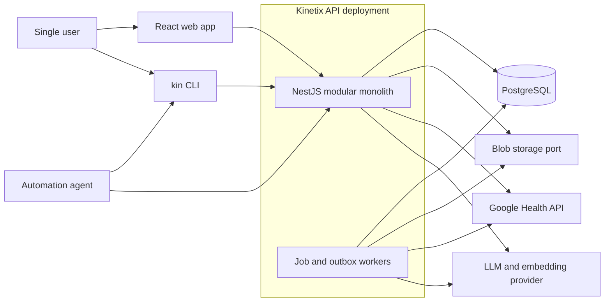
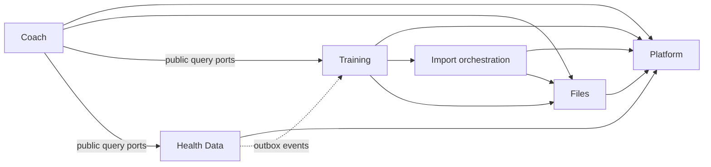
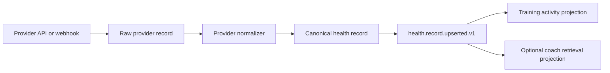
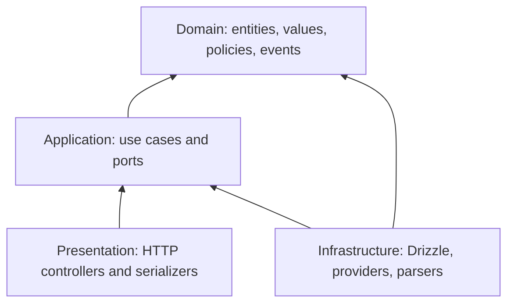

# Kinetix Modular Architecture

**Status:** Proposed · **Audience:** Kinetix engineering · **Last updated:**
2026-07-12

## 1. Purpose

Kinetix is a single-user health and training platform. It manages planned and
completed training, imported and continuously synchronized health data, and
specialized AI coaches whose documents act as editable working memory. The web
application, the `kin` CLI, and external agents must all use the same application
capabilities.

This document defines the high-level architecture and module boundaries. Each
feature still needs its own product requirements and detailed domain design.

The initial system is a TypeScript modular monolith using NestJS, React/Vite,
PostgreSQL/Drizzle, Zod, and REST/OpenAPI. It is deployed to cloud-agnostic
Kubernetes. Service extraction is an option only after a real operational or
scaling need appears.

## 2. Goals and non-goals

### Goals

- Make first-party modules isolated enough to evolve independently.
- Allow users to create configured instances of supported module types, such as
  a running coach and a strength coach.
- Give the web app, CLI, and agents one stable, validated API.
- Preserve the origin and history of imported, synchronized, and agent-edited
  data.
- Keep provider, file storage, and LLM integrations replaceable.
- Support reliable background imports, synchronization, and document indexing
  without introducing microservices.
- Keep the first implementation small and understandable.

### Non-goals

- A third-party plugin marketplace or runtime loading of arbitrary code.
- User-defined schemas, workflows, or executable module types.
- Multiple users, organizations, sharing, or role-based access in the first
  version.
- A universal health-data ontology in the first version.
- Separating modules into independently deployed services from day one.
- Clinical decision support or compliance-specific architecture.

## 3. Architecture principles

1. **A modular monolith first.** Modules have explicit boundaries inside one
   NestJS application and one PostgreSQL database.
2. **Capabilities are compiled; instances are data.** Engineers add a new module
   type in code. A user can only create and configure instances of those known
   types.
3. **The API is the automation boundary.** The web app, CLI, and agents never
   connect directly to the database or provider APIs.
4. **Each module owns its model.** Other modules do not read its tables or import
   its infrastructure classes.
5. **Use synchronous calls by default.** Use events or jobs only when work may be
   slow, retried, or eventually consistent.
6. **Keep raw input and provenance.** Normalized records are useful, but the
   original file or provider representation makes reprocessing and debugging
   possible.
7. **Make writes idempotent.** Imports, provider syncs, webhook handling, CLI
   retries, and agent actions must be safe to repeat.
8. **Prefer explicit models over generic frameworks.** JSONB is appropriate for
   provider payloads and validated type-specific details, not as a replacement
   for core relational entities.
9. **Do not leak infrastructure inward.** Domain and application code do not
   depend on NestJS, Drizzle, HTTP, object storage, or a specific LLM SDK.

## 4. System context



The API and workers remain one codebase and one deployable application. Workers
may initially run in the API process. If API replicas or expensive workloads make
that awkward, the same NestJS application can expose a second worker entrypoint
and Kubernetes workload without changing module boundaries or creating a network
service.

## 5. Modules and instances

The word **module** has two distinct meanings:

- A **module definition** is first-party TypeScript code shipped with Kinetix.
  Examples are `training`, `health-data`, and `coach`.
- A **module instance** is a user-created configuration of a definition. Examples
  are `Strength Coach` and `Marathon Coach`, both instances of `coach`.

Module definitions should expose a small code-level manifest:

```ts
interface KinetixModuleDefinition<TSettings> {
  type: string;
  version: number;
  displayName: string;
  cardinality: 'one' | 'many';
  settingsSchema: z.ZodType<TSettings>;
}
```

The manifest drives the available-module catalog, settings validation, instance
creation, and navigation metadata. NestJS modules are still registered at
application startup; creating a module instance does not load code dynamically.

A small platform-owned `module_instances` table records `id`, `module_type`,
`name`, `slug`, `status`, validated `settings`, and timestamps. Important domain
configuration should be promoted from JSON into the owning module's typed tables.
Domain records reference a module instance only where instance ownership matters.

Cardinality is controlled by the definition:

| Definition             | Initial cardinality | Meaning                                                       |
| ---------------------- | ------------------- | ------------------------------------------------------------- |
| `training`             | one                 | Unified workout, running, planning, and activity history      |
| `health-data`          | one                 | Provider connections, normalized metrics, and sync state      |
| `coach`                | many                | Named coach knowledge bases and conversations                 |
| Future `health-report` | many                | A report workspace with its own files and generated artifacts |

This registry is a lifecycle and discovery mechanism, not a generic entity store.
Training programs, sessions, coach documents, and health observations remain in
their modules' own tables.

## 6. Proposed module map



Solid arrows are allowed compile-time dependencies on public application ports.
The dotted arrow is asynchronous integration. No arrow permits reading another
module's tables or importing its infrastructure.

### 6.1 Platform

Platform contains only capabilities used by several modules:

- module definition catalog and module-instance lifecycle;
- job execution and retry state;
- transactional outbox and in-process event dispatch;
- clock, ID generation, transaction, and logging ports;
- API error conventions and idempotency support.

Platform must not accumulate training, provider, or coach behavior. A utility
belongs here only when at least two modules use the same semantics, not merely
similar-looking code.

### 6.2 Files

Files owns immutable binary assets and their metadata:

- upload and download;
- content type, byte size, checksum, and original filename;
- blob location through a `BlobStore` port;
- lifecycle (`pending`, `available`, `quarantined`, `deleted`);
- text extraction metadata where extraction is shared.

The database stores metadata. Blob bytes should sit behind a storage port. A
local filesystem adapter is sufficient for local development; an S3-compatible
adapter is the preferred Kubernetes production implementation. This keeps the
deployment cloud-agnostic. If storing small files in PostgreSQL is useful for the
first spike, hide that choice behind the same port so callers do not depend on it.

Files do not decide what a spreadsheet or document means. Training imports and
coach documents reference a `file_asset_id` and own interpretation, validation,
and domain behavior.

### 6.3 Imports

Imports supplies shared orchestration for file-driven ingestion:

- import job state and progress;
- preview and detected columns/sheets;
- saved mapping configuration;
- row-level warnings and errors;
- retry and cancellation;
- source checksum and idempotency key.

Each destination module implements its own importer behind a port such as
`TrainingSpreadsheetImporter`. A generic import engine may read workbook cells,
but it must not contain universal mappings for workouts, running plans, or health
reports. The destination module's job handler invokes its importer and the shared
orchestration; Imports does not discover or call module code dynamically.

Recommended workflow:

1. Upload the asset.
2. Parse sheets and return a preview.
3. Select a known import profile or confirm column mappings.
4. Validate the complete input without changing domain data.
5. Commit valid records in bounded transactions.
6. Return created IDs plus a downloadable row-error report.

Imports should preserve the original file, mapping version, source row number,
and import job ID on created records. Re-running the same committed import should
not duplicate data.

The Training MVP does not require this file-ingestion path. Its import boundary is
a versioned, transactional JSON API after source cleanup happens upstream. Build
Files/Imports when Coach or a later raw-file workflow needs them; they are not
prerequisites for Training.

### 6.4 Training

Training owns all planned and completed physical activity. Running belongs in
this module rather than becoming a separate top-level bounded context. It shares
programs, scheduling, activity history, perceived effort, completion state, and
imports with strength and other activities. Run-specific concepts remain typed
instead of being forced into strength-workout tables.

The agreed MVP behavior and acceptance scenarios are specified in the
[Training module PRD](prd/TRAINING.md), with implementation details in the
[Training technical design](design/TRAINING.md).

Core concepts:

- **Program:** an ordered or dated training plan with lifecycle and goals.
- **Program block:** a phase or week grouping planned sessions.
- **Workout template:** a reusable prescription.
- **Planned session:** what is expected on a date or at an order in a program.
- **Activity session:** what actually happened, regardless of manual, imported,
  or provider origin.
- **Strength details:** exercises, prescribed/performed sets, repetitions,
  resistance, rest, tempo, and RPE/RIR.
- **Run details:** distance, duration, pace, elevation, heart-rate summary,
  route reference, laps/splits, and workout intent such as easy or intervals.

`ActivitySession` is the common timeline record and has a discriminated
`activity_type`. Rich data is stored in modality-specific tables such as
`strength_session_exercises`, `strength_sets`, `run_session_details`, and
`run_splits`. Do not build an entity-attribute-value table for all activities.

A planned session may link to zero or one completed activity session. Completion
captures a snapshot of the prescription so later program edits do not rewrite
history. Provider and spreadsheet imports attach a stable source reference and
are upserted idempotently.

Suggested ownership rules:

- Training is authoritative for program structure, workout prescriptions,
  manual activity records, and the user-facing activity timeline.
- Health Data is authoritative for provider observations and high-frequency
  samples.
- A provider exercise record can create or update a Training activity session,
  but the activity links back to the canonical provider record. Training keeps
  only the summary needed for its use cases; it does not copy every sensor sample.

### 6.5 Health Data and provider integrations

Health Data owns external connections, synchronization state, raw provider
records, and canonical health records. Provider-specific code lives in adapters
inside this module, not in Training or Coach.

The provider port should be capability-oriented:

```ts
interface HealthProvider {
  provider: string;
  capabilities(): ProviderCapabilities;
  authorize(input: AuthorizationInput): Promise<AuthorizationResult>;
  refresh(connection: ProviderConnection): Promise<RefreshedCredentials>;
  pullChanges(input: PullChangesInput): AsyncIterable<ProviderRecordPage>;
  subscribe?(input: SubscriptionInput): Promise<SubscriptionResult>;
}
```

Do not make the abstraction mirror one provider's endpoint tree. Capabilities
describe supported record kinds, read/write support, webhooks, granularity, and
cursor behavior.

The ingestion pipeline is:



Store the provider record ID, revision/update time, connection, source device or
application, observed interval, ingestion time, and a hash of the payload. Use a
unique constraint on provider, connection, record type, and external ID. Keep raw
payloads for re-normalization, with a documented retention decision when volume
becomes meaningful.

Canonical health records need to accommodate many metric types without a table
per provider. A pragmatic model is a relational envelope (`record_type`, source,
start/end time, ingestion metadata) plus a type-specific JSONB payload validated
by a discriminated Zod schema. Frequently queried values such as numeric value,
unit, or day may be promoted to indexed columns or dedicated read projections.
Provider payload JSON and canonical payload JSON are separate concepts.

Synchronization is a background job. Persist cursors/checkpoints only after the
associated page has committed. Webhooks should enqueue a sync rather than contain
business logic. Polling and webhook delivery may overlap, so all writes must be
idempotent. Apply bounded exponential retry for rate limits and transient errors;
invalid credentials move the connection to `action_required`.

#### Initial Google/Fitbit direction

As of this document, the **Google Health API** is the next generation of the
Fitbit Web API. It is a server-accessible API using Google OAuth 2.0, supports
REST and gRPC, and provides Fitbit/Pixel and reconciled health data. The legacy
Fitbit Web API is scheduled to stop syncing in September 2026. Kinetix should
therefore implement a `GoogleHealthProvider` using REST first, while retaining a
provider-neutral port. Google Health OAuth scopes are restricted, so access and
security-review prerequisites should be validated before the integration PRD is
committed.

Google Health API is distinct from Android Health Connect. Health Connect is an
on-device Android API and would require a mobile client to read data and forward
it to Kinetix; it is not a drop-in backend replacement.

### 6.6 Coach

A coach is a named module instance combining instructions, private working-memory
documents, conversations, retrieval, and a restricted set of Kinetix tools. It is
not a separate human user or permission role.

Core concepts:

- **Coach profile:** name, purpose, instructions, retrieval settings, model
  policy, and allowed tool capabilities.
- **Document:** a logical wiki page or uploaded asset belonging to one coach.
- **Document revision:** immutable text/content version with author (`user`,
  `agent`, or `import`) and provenance.
- **Chunk/index entry:** derived searchable text tied to an exact revision.
- **Conversation and message:** durable interaction history.
- **Coach run:** one model execution with prompt/model versions, retrieved source
  references, tool calls, status, token usage, and errors.
- **Knowledge item:** an optional curated fact or note promoted from a document or
  conversation into working memory.

Uploaded spreadsheets and plain text become documents through format-specific
parsers. The original file stays immutable. When an agent edits a coach document,
it creates a new document revision rather than overwriting the source. This gives
the wiki normal edit history, makes indexing repeatable, and allows rollback.

Recommended indexing pipeline:

1. Create or revise a document.
2. Enqueue extraction and normalization.
3. Split normalized text into stable chunks.
4. Index lexical text in PostgreSQL full-text search.
5. Optionally create embeddings through an `EmbeddingModel` port and store them
   with `pgvector`.
6. Mark the exact revision as indexed.

The initial data volume is small, so PostgreSQL full-text search plus explicit
document selection can ship before vector search. Retrieval is hidden behind a
`KnowledgeRetriever` port so hybrid/vector retrieval can be added without
changing the chat use case.

The Q&A path retrieves only from the selected coach instance, builds a context
with source IDs, invokes a `LanguageModel` port, and persists citations and run
metadata. Answers should expose their source documents/revisions to the UI and
CLI.

Coach tools call public application commands such as `GetTrainingHistory` or
`ReviseCoachDocument`; they never receive repositories or SQL access. Editing the
coach's own wiki is allowed by its capability policy and always creates a
revision. Future writes to training or health data should use explicit typed
tools and a centrally enforced confirmation policy. Persist tool inputs and
results for debugging even though the product has no compliance requirement.

## 7. Onion architecture inside each module

Each feature module follows the same dependency direction:



### Domain

- Entities, value objects, invariants, domain services, and domain events.
- Pure TypeScript with no NestJS, Drizzle, HTTP, Zod API schema, or vendor SDK
  imports.
- Repository interfaces only when the domain/application needs persistence.

### Application

- One use-case class or function per command/query.
- Transaction boundaries and orchestration.
- Ports for repositories, blob storage, providers, model clients, queues, clocks,
  and IDs.
- Application DTOs that are not coupled to transport decorators.
- Authorization/confirmation hooks can be added here later without rewriting the
  domain.

### Infrastructure

- Drizzle repository implementations and read-model queries.
- Provider, object storage, LLM, spreadsheet, and event-bus adapters.
- Mapping between persistence/provider models and domain objects.
- No business decisions that belong in domain or application code.

### Presentation

- NestJS controllers, request parsing, HTTP status mapping, and OpenAPI metadata.
- Maps versioned public contracts to application commands and maps results back.
- Contains no direct Drizzle calls.

Use repositories for aggregate writes and domain-oriented retrieval. For complex
lists and dashboards, a module-owned query service may use optimized Drizzle SQL
and return a read model. Avoid generic base repositories and DAOs; they erase
domain intent and usually leak persistence behavior.

## 8. Repository layout

The current monorepo should evolve toward this layout without creating a package
for every layer:

```text
apps/
  api/
    src/
      app.module.ts
      platform/
        modules/
        jobs/
        events/
        idempotency/
      modules/
        files/
          domain/
          application/
          infrastructure/
          presentation/
          files.module.ts
          index.ts
        imports/
        training/
        health-data/
        coach/
      shared/
        errors/
        observability/
  web/
    src/
      features/
        training/
        health-data/
        coaches/
      shared/
  kin/
    src/
      commands/
        training/
        health/
        coach/
      api-client/
packages/
  config/
  db/
    src/
      schema/
        platform.ts
        files.ts
        imports.ts
        training.ts
        health-data.ts
        coach.ts
    drizzle/
  types/
    src/
      common/
      modules/
      training/
      health-data/
      coach/
docs/
  ARCHITECTURE.md
  adr/
```

`packages/db` remains the migration and Drizzle-schema home, split into files by
owning module instead of growing one `schema.ts`. It is infrastructure: domain and
application layers must not import it.

`packages/types` contains only public wire contracts shared by API, web, and CLI.
It must not become the domain model. A server module maps between domain types and
these Zod schemas. Subpath exports should prevent consumers from importing the
entire contract package accidentally.

Every API module exposes a deliberately small public `index.ts` containing its
NestJS module and any application ports intended for another module. Cross-module
imports into `domain/`, `infrastructure/`, or another module's database schema are
forbidden. Enforce the rule with ESLint import boundaries once modules appear.

## 9. Communication and consistency

### Synchronous calls

Use a direct application interface when the caller needs the answer to finish its
operation and both modules are in the same transaction/deployment. Examples:

- Coach retrieves a training summary before asking the model.
- Training asks Files for asset metadata before starting an import.
- A controller invokes a training command and returns the created session.

The callee's public application port is injected through NestJS. Do not make
internal HTTP calls inside the monolith.

### Background jobs

Use a durable job when work is slow, rate-limited, retryable, or user-visible as
progress:

- spreadsheet parsing and import;
- Google Health synchronization;
- webhook reconciliation;
- document extraction, chunking, and embedding;
- long-running coach executions if synchronous streaming becomes unreliable.

Start with a PostgreSQL-backed jobs table and workers that claim rows using
transactional locking. This avoids introducing Redis solely for queues. Store
attempt count, next-attempt time, lease/heartbeat, structured error, progress,
and an idempotency key. Multiple Kubernetes replicas must be safe.

### Events

Use events to announce committed facts to optional consumers:

- `training.activity.completed.v1`
- `health.record.upserted.v1`
- `coach.document.revised.v1`
- `import.completed.v1`

Do not use an event for a cross-module invariant that must succeed immediately.
Publish durable events through a transactional outbox written in the same
transaction as the domain change. A worker dispatches the outbox event to
in-process handlers. Consumers record processed event IDs when their action is
not naturally idempotent.

Events use stable names, an explicit version, event ID, occurrence time,
correlation/causation IDs, and the minimum payload needed by consumers. Keep
internal domain events separate from integration events. This outbox also creates
a clean seam for a future message broker if a module is ever extracted.

### Decision table

| Interaction                            | Mechanism                             | Reason                                   |
| -------------------------------------- | ------------------------------------- | ---------------------------------------- |
| CRUD command/query from web or CLI     | REST, synchronous                     | Immediate result and one public contract |
| Query another module during a use case | Injected application port             | Same process; no network ceremony        |
| Parse/import spreadsheet               | Durable job                           | Slow, resumable, reports progress        |
| Provider synchronization               | Durable job                           | Rate limits and retries                  |
| Notify modules of a committed fact     | Outbox event                          | Decoupled, reliable side effects         |
| Enforce a same-operation invariant     | Direct application call/transaction   | Eventual consistency is insufficient     |
| Ask coach a short question             | HTTP streaming or synchronous request | Interactive result                       |
| Re-index coach knowledge               | Durable job triggered by event        | Derived and safely retryable             |

## 10. Persistence guidelines

- Use UUIDs generated by the application or PostgreSQL consistently.
- Store all instants as `timestamptz`; retain the source time zone/offset when it
  affects interpretation, especially workouts, sleep, and provider records.
- Represent durations explicitly in seconds or milliseconds and units explicitly
  in canonical values. Never infer units from locale.
- Include `created_at` and `updated_at`; add a `version` column for optimistic
  concurrency on editable aggregates such as programs and documents.
- Prefer immutable revisions for plans/documents where history matters.
- Use foreign keys inside a module. Cross-module foreign keys are acceptable for
  stable platform identifiers such as `module_instance_id` and `file_asset_id`,
  but behavioral coupling still goes through application ports.
- Use JSONB only with a named, versioned Zod schema. Store a schema version beside
  long-lived JSON payloads.
- Apply unique source constraints for all external/imported records.
- Migrations are forward-only, generated through Drizzle, reviewed as SQL, and
  committed. Backfills that call providers or models run as jobs, not migrations.
- Database transactions belong to application use cases. Repository methods do
  not silently start independent transactions.

The starter `projects` table and contracts are scaffolding and should be removed
when the first real module schema is introduced.

## 11. Public API and contracts

REST under `/api/v1` remains the external interface. Prefer domain resource names
over exposing internal layer names.

Illustrative endpoints:

```text
GET    /modules
GET    /module-instances
POST   /module-instances
PATCH  /module-instances/:id

GET    /training/programs
POST   /training/programs
GET    /training/sessions
POST   /training/sessions
POST   /training/imports
GET    /training/imports/:id

GET    /health/connections
POST   /health/connections/google-health/authorize
POST   /health/connections/:id/syncs
GET    /health/records
GET    /jobs/:id

GET    /coaches
POST   /coaches
POST   /coaches/:id/documents
POST   /coaches/:id/documents/:documentId/revisions
POST   /coaches/:id/conversations
POST   /coaches/:id/conversations/:conversationId/messages
```

Feature-specific creation endpoints such as `POST /coaches` may internally create
a module instance; callers do not need to orchestrate registry and domain records.

Contract conventions:

- Define request, response, enum, filter, pagination, and error Zod schemas in
  `@kinetix/types`.
- Use names such as `createTrainingProgramRequestSchema` and
  `trainingProgramResponseSchema`; avoid one schema reused for persistence,
  domain, input, and output.
- Use cursor pagination for long time-series/history lists and stable sort keys.
- Return `202 Accepted` plus a job resource for asynchronous commands.
- Support `Idempotency-Key` on imports, sync triggers, and agent/CLI writes.
- Return machine-readable errors with `code`, `message`, optional `fieldErrors`,
  and `correlationId`.
- Treat Zod as the validation source of truth and derive NestJS/OpenAPI metadata
  through a compatible adapter rather than maintaining duplicate validators. Add
  a CI check that the published OpenAPI document stays in sync.

## 12. CLI and agent automation

The CLI is a thin, scriptable API client. It shares wire schemas but no domain,
repository, database, or provider code with the API.

Suggested command surface:

```text
kin training programs list
kin training programs import ./plan.xlsx
kin training sessions add --type strength --date 2026-07-12 ...
kin run add --distance 10km --duration 52m
kin health connect google
kin health sync --wait
kin coach create "Running Coach"
kin coach docs add running-coach ./program.xlsx
kin coach ask running-coach "Adjust next week based on my last four runs"
```

`kin run` can be an ergonomic alias over Training API contracts; it must not
create a second run-specific backend.

Every data command should support `--json`, deterministic non-zero exit codes,
non-interactive input, and stdin where useful. Human-friendly output is the
default for a terminal, while agents should use `--json`. Long jobs return their
ID and optionally support `--wait`, bounded by a CLI timeout. Commands that mutate
data should accept or generate an idempotency key.

## 13. Web application boundaries

Mirror backend capabilities under `apps/web/src/features`, but do not attempt to
reuse backend domain objects. Each feature owns its routes, API hooks, forms,
tables, and view models. A shared generated or handwritten API client uses
`@kinetix/types` validation at the network boundary.

TanStack Query keys should include module-instance IDs and filters. Invalidate
the narrowest relevant keys after writes. Jobs and sync progress may begin with
polling; real-time transport should be added only when polling becomes a user
experience problem.

Navigation can be built from enabled module instances plus code-defined UI
metadata. Do not allow database settings to name arbitrary React components.

## 14. Security baseline

There is no application authentication in the first version. Therefore, an
unauthenticated deployment must be considered trusted/local and must not be
publicly reachable. Authentication becomes a release blocker before exposing the
API on the public internet.

Even in the single-user version:

- keep OAuth refresh tokens and provider/LLM secrets out of logs and encrypt
  stored credentials using a deployment-provided key;
- use least-privilege provider scopes;
- validate file type and size and never execute uploaded content;
- prevent spreadsheet formula execution and path traversal;
- use short-lived signed blob URLs or stream files through the API;
- isolate retrieval by `coach_instance_id` in every query;
- treat retrieved text as untrusted input and restrict coach tools independently
  of model instructions;
- log agent/model tool actions and document revisions;
- support deleting provider credentials, source files, derived chunks, and model
  indexes together.

These are correctness and privacy safeguards, not a claim of regulatory
compliance.

## 15. Observability and operations

- Give every HTTP request, job, sync, import, coach run, and event a correlation
  ID; preserve causation across their boundaries.
- Use structured logs with module, operation, entity/job ID, attempt, duration,
  and outcome. Redact documents, prompts, health payloads, and tokens by default.
- Record metrics for API latency/errors, job age and failures, provider rate
  limits, sync lag, import row failures, document indexing time, and coach model
  latency/token use.
- Readiness should fail when PostgreSQL is unavailable. Optional providers should
  report degraded state without failing API readiness.
- Schedulers and workers must use database leases/locks so multiple Kubernetes
  replicas do not duplicate periodic syncs.
- Back up PostgreSQL and blob storage as one logical dataset; test restoration.

## 16. Testing strategy

- **Domain unit tests:** invariants and policies with no framework or database.
- **Application tests:** use cases with in-memory/fake ports, including
  idempotency and transaction failures.
- **Persistence integration tests:** real PostgreSQL for Drizzle mappings,
  constraints, and repository behavior.
- **Provider contract tests:** recorded/synthetic Google Health responses,
  pagination, cursor, token refresh, rate limit, and deletion cases.
- **Importer fixture tests:** representative spreadsheets, mapping versions,
  partial errors, and repeat imports.
- **LLM-independent coach tests:** deterministic fake model/retriever; test
  citations, isolation, revisions, and tool policies without asserting prose.
- **API/CLI end-to-end tests:** the same operation through HTTP and CLI JSON mode.
- **Architecture tests/lint rules:** prohibit cross-module infrastructure/schema
  imports and framework imports from domain folders.

## 17. Evolution and service extraction

Do not extract a service because a module exists. Consider extraction only when
there is evidence such as independent scaling, conflicting availability needs,
unsafe dependencies, a separate team ownership boundary, or a deployment cadence
that the monolith blocks.

Before extraction, a module should already have:

- exclusive data ownership;
- a small public application interface;
- versioned integration events;
- no foreign table reads by consumers;
- idempotent event handling;
- clear operational metrics.

At extraction time, replace the injected application port with a network adapter
and the in-process outbox dispatcher with a broker. The domain and callers should
not need wholesale redesign.

## 18. Recommended implementation sequence

1. Establish module folders, contract conventions, database schema split, common
   error format, core profile/manual health context, the minimal PostgreSQL job
   runner, and architecture lint rules.
2. Build the Training MVP around the exercise catalog, programs, planned sessions,
   mixed completed activities, structured JSON ingestion, progression, and
   deterministic analytics.
3. Build Files and Imports when the first raw-file workflow requires them.
4. Add Google Health OAuth, incremental sync, raw/canonical records, and the
   Training activity projection to Health Data.
5. Add Coach profiles, versioned documents, extraction, PostgreSQL full-text
   retrieval, conversations, and model runs.
6. Add agent-editable coach documents and typed read-only Training tools; add
   mutating tools only with an explicit confirmation policy.
7. Add pgvector/hybrid retrieval, webhooks, and separate worker processes only
   when the simpler implementations demonstrate the need.

## 19. Decisions to capture as ADRs

Create short Architecture Decision Records as implementation clarifies these
choices:

- ADR-001: Modular monolith and module dependency rules.
- ADR-002: Code-defined module catalog and runtime module instances.
- ADR-003: Running as a Training activity subtype.
- ADR-004: PostgreSQL jobs and transactional outbox.
- ADR-005: Blob storage adapter and production backend.
- ADR-006: Canonical health-record envelope and provider provenance.
- ADR-007: Google Health API integration and OAuth credential storage.
- ADR-008: Coach revision, retrieval, and model-provider strategy.
- ADR-009: Agent tool capabilities and mutation confirmation policy.

## 20. External references

- [Google Health API overview](https://developers.google.com/health)
- [Google Health API migration specifications](https://developers.google.com/health/migration/api-specifications)
- [Google Health API getting started and protocol options](https://developers.google.com/health/get-started)
- [Android Health Connect architecture](https://developer.android.com/health-and-fitness/health-connect/architecture)
