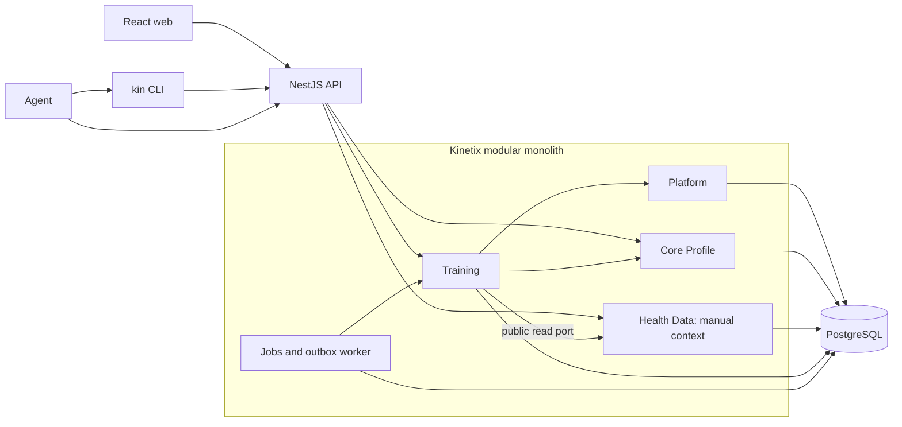
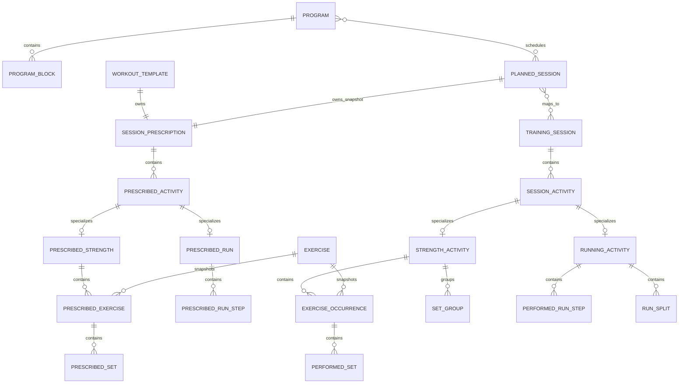
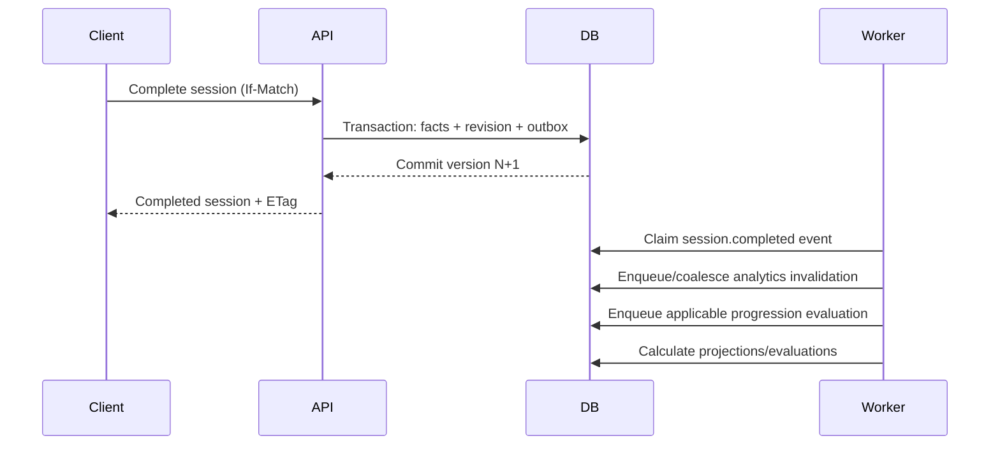

# Training Module Technical Design

**Status:** Proposed · **Implements:** Training MVP PRD · **Audience:** Kinetix
engineering · **Last updated:** 2026-07-12

## 1. Purpose

This document translates the
[Training Module Product Requirements](../prd/TRAINING.md) into an implementable
design for the Kinetix TypeScript modular monolith. It defines module boundaries,
domain aggregates, the relational model, revision semantics, public contracts,
progression execution, analytics, background work, and delivery order.

The design follows the [Kinetix architecture](../ARCHITECTURE.md): NestJS,
PostgreSQL/Drizzle, Zod/OpenAPI, React/Vite, and the `kin` CLI. PostgreSQL is the
only stateful runtime dependency for Training MVP.

## 2. Design decisions

The implementation shall follow these decisions unless an ADR explicitly changes
one:

1. **Training is one bounded context.** Strength and running are typed activities
   within a common session envelope.
2. **Plans and performances are separate aggregates.** They are connected by
   explicit mapping tables rather than shared mutable rows.
3. **Prescriptions use one immutable normalized structure.** Templates and
   planned sessions point to independent prescription versions. Editing creates a
   new normalized prescription tree and advances the owner's current pointer;
   generating a plan clones a template prescription and never retains a live
   mutable reference.
4. **Current state is normalized; history is snapshot-based.** Editable aggregate
   roots carry an integer version. Each successful mutation stores a validated
   aggregate snapshot and human-readable summary in a generic immutable revision
   store.
5. **Exercise semantics are snapshotted.** Planned and performed occurrences keep
   the exercise metadata needed to reproduce historical analytics.
6. **Canonical measurements are relational columns.** Entered units and source
   representation are preserved in validated JSON only for display/provenance.
7. **Tags use typed join tables.** Repetition is preferred over a polymorphic
   assignment table that cannot enforce foreign keys.
8. **Rules and algorithms are code-registered and versioned.** Their definitions
   may be stored as data, but callers cannot introduce executable code.
9. **Analytics are projections.** Raw facts remain authoritative; derived results
   may be invalidated, marked stale, and rebuilt.
10. **Durable work uses PostgreSQL.** Jobs and transactional outbox events run in
    the API deployment with row leasing; Redis and a broker are not required.
11. **The JSON bulk boundary replaces spreadsheet parsing.** Source cleanup occurs
    upstream, then an agent calls dry-run and transactional commit.
12. **Aggregate writes use optimistic concurrency.** REST responses expose ETags;
    mutating requests provide `If-Match` or an equivalent expected version.

## 3. Runtime and module context



Training may synchronously read core profile and manual Health Data through
public application ports. It does not import their persistence schemas or query
their tables. Session completion emits durable facts that drive progression and
analytics jobs.

## 4. Source layout and dependency rules

```text
apps/api/src/
  platform/
    modules/
    jobs/
    events/
    idempotency/
    revisions/
  modules/
    profile/
      domain/
      application/
      infrastructure/
      presentation/
    health-data/
      domain/
      application/
      infrastructure/
      presentation/
    training/
      domain/
        catalog/
        planning/
        sessions/
        progression/
        analytics/
        shared/
      application/
        catalog/
        planning/
        sessions/
        progression/
        analytics/
        ports/
      infrastructure/
        persistence/
        jobs/
        analytics/
        seed/
      presentation/
        http/
      training.module.ts
      index.ts

apps/web/src/features/
  profile/
  training-catalog/
  training-programs/
  training-session/
  training-analytics/

apps/kin/src/commands/training/
packages/db/src/schema/
  platform.ts
  profile.ts
  health-data.ts
  training-catalog.ts
  training-planning.ts
  training-sessions.ts
  training-progression.ts
  training-analytics.ts
packages/types/src/
  common/
  profile/
  health-data/
  training/
    catalog/
    planning/
    sessions/
    progression/
    analytics/
    bulk/
```

Rules:

- Domain code imports only domain/shared primitives.
- Application code imports domain code and declared ports.
- Infrastructure implements ports and may import Drizzle/provider libraries.
- Presentation maps public Zod contracts to application commands/queries.
- Other modules import only exports from `training/index.ts`.
- `@kinetix/types` contains wire contracts, not domain entities.
- `@kinetix/db` is never imported by domain/application code.

## 5. Aggregate boundaries

### 5.1 CoreProfile

Owns the single user's date of birth, sex, current height, time zone, and unit
preferences. Height is mutable without historical measurement tracking, but the
profile root still has normal revision history for user-visible restore.

### 5.2 ManualHealthRecord

Owns one manual bodyweight, sleep, resting-heart-rate, or daily-readiness record.
Health Data exposes time-window queries to Training. Provider records will later
use the same canonical envelope without changing Training interfaces.

### 5.3 TrainingProfile

Owns training experience and default analytics/rule settings. Goals, injuries,
limitations, training maxima, zone definitions, and owned equipment are separate
roots or time-series records because they change independently and can invalidate
different analytic scopes.

### 5.4 ExerciseDefinition

Owns name, aliases, catalog classifications, muscle roles, supported measurement
model, relationships, tags, and archived state. Seeded exercises are immutable
parents; editing one creates a user-owned definition/version. Merge is an
application workflow across two ExerciseDefinition roots and an alias redirect.

### 5.5 WorkoutTemplate

Owns template metadata and one `SessionPrescription` tree. A template edit
creates a new immutable normalized prescription tree, advances the template's
current pointer, and creates a new aggregate revision. Generated planned sessions
receive cloned prescription trees.

### 5.6 Program

Owns program metadata and its nested blocks. Planned sessions are separate
aggregates linked through join rows, allowing one planned session to participate
in several programs. Program activation generates all program-owned planned
sessions in one application transaction at MVP scale.

### 5.7 PlannedSession

Owns schedule/relative position, lifecycle, and an independent
`SessionPrescription`. A progression action or explicit future-session update
creates a new immutable prescription plus a PlannedSession revision. A completed
session always maps to the prescription ID that was in force when performance
began.

### 5.8 TrainingSession

Owns session time/state, readiness, post-session ratings, pain records, activities,
strength occurrences/groups/sets, run summaries/steps/splits, tags, and all
planned/actual mappings. It is the concurrency boundary for live workout writes;
any child mutation increments the session version.

### 5.9 ProgressionRule and ProgressionEvaluation

A ProgressionRule is an editable versioned root containing a validated condition
AST, action definitions, scope, trigger configuration, and auto-application
policy. A ProgressionEvaluation is immutable evidence plus mutable approval state.
Applying it writes new target aggregate revisions and records their IDs.

### 5.10 DerivedMetric and Finding

Derived metrics and findings are projections, not domain truth. They are uniquely
identified by metric/finding key, algorithm version, scope, period, dimensions,
and input fingerprint. Recalculation inserts a new result and marks the previous
projection superseded so earlier outputs remain explainable.

## 6. Domain relationships



The diagram omits mapping and catalog join tables for readability. Separate
foreign-keyed mapping tables connect activities, exercises, sets, and run steps.

## 7. Persistence conventions

### 7.1 Common columns

Editable aggregate roots use:

```text
id uuid primary key
training_instance_id uuid where applicable
version integer not null default 1
created_at timestamptz not null
updated_at timestamptz not null
archived_at timestamptz null where applicable
source_namespace text null
external_id text null
```

Bulk-addressable tables enforce a partial unique constraint on
`(source_namespace, external_id)` when both are present. Child rows also accept
external IDs so an agent can idempotently update a complete tree.

All ordered children use a non-negative integer `position` and a unique
constraint within their parent. Application commands normalize positions after
reordering.

### 7.2 UUID and time policy

- The application generates UUIDs before persistence so IDs can be referenced
  inside aggregate commands and outbox payloads.
- Instants use `timestamptz` and UTC transport strings.
- Local training dates use PostgreSQL `date` plus an IANA time-zone identifier.
- Preferred local time uses `time` without converting an undated relative plan to
  an instant.
- A session crossing midnight retains its start-local date.

### 7.3 Numeric policy

Canonical columns use:

| Quantity           | PostgreSQL representation | Canonical unit              |
| ------------------ | ------------------------- | --------------------------- |
| Mass/load          | `numeric(12,3)`           | kg                          |
| Distance/height    | `numeric(14,3)`           | metre                       |
| Duration           | `bigint`                  | millisecond                 |
| Power              | `numeric(12,2)`           | watt                        |
| Speed              | `numeric(12,4)`           | metre/second                |
| Heart rate/cadence | `integer`                 | bpm/rpm                     |
| RPE                | `numeric(3,1)`            | 1–10                        |
| RIR                | `smallint`                | 0–10                        |
| Subjective scale   | `smallint`                | 1–5                         |
| Percent/fraction   | `numeric(8,5)`            | ratio or documented percent |

Drizzle returns PostgreSQL `numeric` as strings at the persistence boundary.
Mappers convert through a decimal-safe domain value rather than binary floating
point. API values remain JSON numbers within validated product ranges.

### 7.4 Entered representation

Commands accept measurements as `{ value, unit }`. Persistence stores canonical
columns for query/calculation and a validated `entered_measurements` JSONB object
containing the original value/unit per field. This JSON never replaces canonical
columns and cannot be used as the primary analytics query surface.

`null` remains distinct from zero. Database checks reject negative quantities
unless the field explicitly permits them; assistance is stored as a positive
quantity and subtracted only by a declared load model.

### 7.5 State and discriminator values

Use `text` plus explicit check constraints for evolving states/discriminators
rather than PostgreSQL enums. Zod/domain unions are the code source of truth and
migrations update the database checks.

Initial values:

| Concept             | Values                                                                                                                       |
| ------------------- | ---------------------------------------------------------------------------------------------------------------------------- |
| Program             | `draft`, `active`, `paused`, `completed`, `archived`                                                                         |
| Planned session     | `planned`, `completed`, `partially_completed`, `skipped`, `cancelled`                                                        |
| Training session    | `draft`, `in_progress`, `completed`, `archived`                                                                              |
| Activity            | `strength`, `running`                                                                                                        |
| Set group           | `straight`, `superset`, `circuit`, `drop`, `cluster`, `rest_pause`                                                           |
| Set type            | `warm_up`, `working`, `back_off`, `drop`, `failure_amrap`, `superset_circuit`, `rest_pause`, `technique`, `cluster`, `other` |
| Performed set state | `completed`, `partial`, `skipped`, `added`                                                                                   |
| Run step            | `warm_up`, `work`, `recovery`, `repeat`, `cool_down`, `open`                                                                 |
| Mapping relation    | `matched`, `substituted`, `added`, `partial`, `combined`, `split`                                                            |
| Change source       | `web`, `cli`, `agent`, `bulk_import`, `progression_rule`, `manual_correction`, `provider_sync`                               |

Custom block labels, tags, equipment, and movement patterns remain data rather
than discriminators.

## 8. Platform and supporting tables

### 8.1 Platform

| Table                 | Purpose and important fields                                                                                                                                              |
| --------------------- | ------------------------------------------------------------------------------------------------------------------------------------------------------------------------- |
| `module_instances`    | First-party module lifecycle: `module_type`, `name`, `slug`, `status`, validated `settings`, `version`. MVP seeds one active Training instance.                           |
| `entity_revisions`    | Immutable snapshots: `entity_type`, `entity_id`, `version`, `snapshot`, `summary`, `source`, `actor`, `correlation_id`, `reason`, `created_at`. Unique on entity/version. |
| `idempotency_records` | `operation`, `key`, request hash, status, response status/body, expiry. Same key with a different hash is a conflict.                                                     |
| `outbox_events`       | Event ID/type/version, aggregate identity/revision, payload, correlation/causation IDs, status, attempts, next attempt.                                                   |
| `jobs`                | Job type/version, payload, state, priority, attempts, next attempt, lease owner/expiry, heartbeat, progress, error, idempotency key.                                      |
| `bulk_dry_runs`       | Normalized proposed payload, payload/reference hash, warnings, expiry, state, schema version, source namespace.                                                           |

`entity_revisions` is intentionally polymorphic because it is an immutable audit
store. Business tables do not depend on it by foreign key; the application writes
current normalized state and its revision snapshot in one transaction.

### 8.2 Core Profile

`profiles` contains the single row used by MVP:

- optional date of birth, sex, and height in canonical metres;
- required time zone and unit preferences;
- root version and timestamps.

The application enforces one active profile. Training commands obtain its ID and
defaults through `ProfileReader` rather than assuming a magic UUID.

### 8.3 Manual Health Data

`health_records` uses a canonical envelope:

- `id`, `profile_id`, `record_type`, `source` (`manual` in MVP);
- `start_at`, `end_at`, `local_date`, `time_zone` as applicable;
- promoted `numeric_value` and `unit` for simple observations;
- versioned, discriminated `data` JSONB for sleep/readiness structure;
- version/timestamps/archive state.

Initial discriminators are `body_weight`, `sleep`, `resting_heart_rate`, and
`daily_readiness`. Type-specific Zod schemas validate `data`. Index
`(profile_id, record_type, local_date)`.

## 9. Training profile and catalog tables

### 9.1 Training context

| Table                       | Purpose                                                                                                      |
| --------------------------- | ------------------------------------------------------------------------------------------------------------ |
| `training_profiles`         | Experience, default analytics settings, default 1RM repetition cutoff, hard-set thresholds, overall version. |
| `training_goals`            | Type, target value/unit, start/target dates, priority, status, and notes.                                    |
| `training_injuries`         | Name, body area, side, severity, status, dates, notes.                                                       |
| `training_injury_muscles`   | Injury-to-muscle links.                                                                                      |
| `training_injury_exercises` | Injury-to-exercise links.                                                                                    |
| `training_maxes`            | Exercise, max type (`estimated_1rm`, `training_max`, custom), value kg, effective interval, source/revision. |
| `zone_definitions`          | Zone family (`heart_rate`, `pace`, `power`), method, effective interval, version/configuration.              |
| `zone_ranges`               | Definition, position/name, inclusive/exclusive lower/upper canonical bounds.                                 |
| `gear_items`                | User-owned shoes/equipment, type, acquired/retired dates, distance limit, notes, archived state.             |

Training maxima and zone definitions are append/version oriented: changing the
current value closes the previous effective interval and inserts a new record.

### 9.2 Exercise catalog

| Table                    | Purpose                                                                                                                                                                   |
| ------------------------ | ------------------------------------------------------------------------------------------------------------------------------------------------------------------------- |
| `muscle_groups`          | System-controlled slug/name/order/active state.                                                                                                                           |
| `equipment_types`        | Seeded or custom equipment; custom flag and analytics mapping status.                                                                                                     |
| `movement_patterns`      | Seeded or custom pattern; custom flag and analytics mapping status.                                                                                                       |
| `exercises`              | User/seed ownership, name, status, equipment, movement, compound/isolation, laterality, body position, repetition semantics, load model, supported measurements, version. |
| `exercise_aliases`       | Case-folded alias, exercise ID, source, unique normalized value among active redirects.                                                                                   |
| `exercise_muscles`       | Exercise/muscle/role (`primary`, `secondary`), unique per pair.                                                                                                           |
| `exercise_relationships` | Source/target/type (`variation`, `progression`, `regression`, `analytics_family`), direction and active state.                                                            |
| `exercise_merges`        | Reversible canonical/merged IDs, revision evidence, applied/reverted times.                                                                                               |

`exercises.load_model` is one of:

- `external_only`;
- `full_bodyweight_plus_added_minus_assistance`;
- `manual_effective_load`;
- `none`.

Kinetix derives effective load only when the selected model supports an objective
calculation. It does not invent bodyweight fractions for movements such as
push-ups. Bodyweight, added load, and assistance remain queryable independently.

### 9.3 Exercise snapshot

Prescribed and performed occurrences store a validated `exercise_snapshot` JSONB
with:

```ts
interface ExerciseSnapshotV1 {
    schemaVersion: 1;
    exerciseId: string;
    exerciseVersion: number;
    name: string;
    equipmentTypeId?: string;
    movementPatternId?: string;
    classification?: "compound" | "isolation";
    laterality?: "bilateral" | "unilateral";
    repetitionSemantics: "total" | "per_side" | "alternating";
    loadModel: "external_only" | "full_bodyweight_plus_added_minus_assistance" | "manual_effective_load" | "none";
    muscles: Array<{ muscleGroupId: string; role: "primary" | "secondary" }>;
}
```

The snapshot is a historical fact, while `exercise_id` supports current catalog
navigation and latest-definition re-analysis.

## 10. Planning and prescription tables

### 10.1 Reusable prescription structure

`session_prescriptions` is the immutable normalized root shared by templates and
planned sessions. A template and a planned session always reference different
prescription IDs. Prescribed child rows are never updated or deleted after the
tree is published; an edit creates a new tree.

Every prescribed activity, exercise, group, set, and run step has:

- an immutable row ID identifying that exact prescription version;
- a `logical_key` preserved when the same logical element is copied into the next
  version of one owner;
- optional source-template lineage identifying the logical key from which a
  planned element was cloned.

Exact planned/actual mappings reference immutable row IDs. Progression rules and
“update future occurrences” operations use logical/source lineage selectors so
they survive cloning without guessing from names or positions. New elements
receive new logical keys; removed elements are absent from the new tree but remain
in prior immutable versions.

| Table                            | Purpose                                                                                                                           |
| -------------------------------- | --------------------------------------------------------------------------------------------------------------------------------- |
| `session_prescriptions`          | Immutable kind (`template`, `planned`, `resolved_execution`), expected duration, notes, schema version, creation/source metadata. |
| `prescribed_activities`          | Prescription ID, type, position, expected duration, RPE/notes.                                                                    |
| `prescribed_strength_activities` | One-to-one type detail for a prescribed activity.                                                                                 |
| `prescribed_exercises`           | Activity, exercise ID/snapshot, position, purpose, substitution policy.                                                           |
| `prescribed_set_groups`          | Activity, optional parent group, type, position, rounds/rest.                                                                     |
| `prescribed_set_group_members`   | Group-to-exercise membership and position.                                                                                        |
| `prescribed_sets`                | Exercise/group, position/round, set type, structured target columns, tempo/rest, notes.                                           |
| `prescribed_running_activities`  | Run tags, overall distance/duration/pace/HR/power targets.                                                                        |
| `prescribed_run_steps`           | Parent step for repeats, type, position, repeat count, structured target ranges, notes.                                           |

Exactly one strength/running detail row must exist for each prescribed activity
according to its discriminator. This is enforced by application invariants and
persistence integration tests; PostgreSQL foreign keys protect each detail row.

### 10.2 Target columns

`prescribed_sets` and relevant running tables store min/max canonical columns:

- `reps_min`, `reps_max`;
- `load_kg_min`, `load_kg_max`;
- `duration_ms_min`, `duration_ms_max`;
- `distance_m_min`, `distance_m_max`;
- `speed_mps_min`, `speed_mps_max` for run pace/speed targets;
- `power_w_min`, `power_w_max`;
- `rpe_min`, `rpe_max`, `rir_min`, `rir_max`;
- `percent_1rm`, `percent_training_max`;
- optional tempo phases and rest range;
- entered target representations for display/provenance.

Checks require minimums not to exceed maximums and mutually contradictory load
target modes to be absent. Percentage prescriptions resolve to a persisted
absolute target when a Training session is started, using the latest effective
max and equipment increment. The planned formula/value remains in the
prescription snapshot.

Resolution creates an immutable `resolved_execution` prescription cloned from the
planned prescription. It retains source row IDs/logical keys, the original
percentage/formula, the max and equipment configuration used, and the resolved
absolute targets. The session mapping references both source and resolved
prescription IDs. If no target requires resolution, both references may identify
the planned prescription.

### 10.3 Templates, programs, and sessions

| Table                            | Purpose                                                                                                                                            |
| -------------------------------- | -------------------------------------------------------------------------------------------------------------------------------------------------- |
| `workout_templates`              | Name, description, current prescription ID, status, version.                                                                                       |
| `workout_template_prescriptions` | Template ID/version to immutable prescription ID, preserving every published template prescription.                                                |
| `programs`                       | Name, lifecycle, schedule mode, optional start/end, goal/focus, version.                                                                           |
| `program_blocks`                 | Program, parent block, type/label, position, relative/date range, targets, deload, expected adaptations.                                           |
| `planned_sessions`               | Lifecycle, optional local date/time zone/preferred time, skip/cancel reason and notes, current prescription ID, source template/revision, version. |
| `planned_session_prescriptions`  | Planned-session ID/version to immutable prescription ID, preserving every published prescription.                                                  |
| `program_planned_sessions`       | Program/session membership plus program-relative week/day/sequence.                                                                                |
| `planned_session_blocks`         | Planned session/block membership; supports overlapping/nested scopes.                                                                              |
| `program_goals`                  | Program-to-training-goal link.                                                                                                                     |

Block hierarchy must be acyclic and remain within one program. Overlap and
schedule collision are warnings, not constraint failures.

Activating a program:

1. Locks and validates the expected Program version.
2. Expands relative schedule rules.
3. Clones each source template prescription into an immutable planned
   prescription tree while retaining source-template logical lineage.
4. Writes program/session/block relationships.
5. Updates program state/version and revision snapshot.
6. Writes planned-session revisions and an outbox event.
7. Commits all generated sessions atomically.

An undated relative program performs the same expansion without calendar dates.

## 11. Actual session tables

### 11.1 Session root and activities

| Table                 | Purpose                                                                                                           |
| --------------------- | ----------------------------------------------------------------------------------------------------------------- |
| `training_sessions`   | State, local date/time zone, start/end, explicit duration, pre/post ratings, notes, version/archive.              |
| `session_activities`  | Session, discriminator, position, start/end/duration, RPE/feelings, notes.                                        |
| `strength_activities` | One-to-one strength detail.                                                                                       |
| `running_activities`  | One-to-one running summary with promoted canonical fields and optional environment JSON.                          |
| `pain_records`        | Session plus optional activity/exercise/set FK, body area, side, severity, type, onset/stopped-work flags, notes. |

The session root contains pre-workout energy, motivation, fatigue, soreness,
stress, and recovery plus post-workout energy, motivation, enjoyment, difficulty,
and fatigue. All range checks are database constraints as well as Zod validation.

Activity duration does not have to sum to session duration. Starting a session
sets `started_at` and resolves percentage-based targets; timer displays remain a
web/CLI concern.

### 11.2 Strength detail

| Table                  | Purpose                                                                                                                                |
| ---------------------- | -------------------------------------------------------------------------------------------------------------------------------------- |
| `exercise_occurrences` | Strength activity, exercise/current ID, immutable snapshot, position, purpose, technique/discomfort/pump, notes.                       |
| `set_groups`           | Strength activity, optional parent group, type, position, round/rest metadata.                                                         |
| `set_group_members`    | Group-to-exercise occurrence membership and position.                                                                                  |
| `performed_sets`       | Occurrence, optional group/round, position, type/state, all promoted measurements, effort, tempo/rest, quality, failure reason, notes. |

`performed_sets` includes canonical columns for repetitions, external load,
bodyweight, added load, assistance, optional caller-supplied effective load,
duration, distance, power, RPE, RIR, and structured tempo/rest. The calculator
derives effective load only through the snapshotted exercise load model.

For an exercise with `per_side` semantics, stored `reps = 10` displays as ten per
side. Calculators expand this to 20 work repetitions when a total-work formula
requires it and label that transformation in metric details.

### 11.3 Running detail

`running_activities` promotes frequently queried summary fields:

- distance metres;
- moving and elapsed milliseconds;
- average/max heart rate;
- average cadence and power;
- elevation gain/loss;
- calories;
- stride length, ground-contact time, vertical oscillation;
- VO₂ max estimate;
- indoor/treadmill flags;
- optional gear item;
- route reference and optional validated GeoJSON/polyline without requiring
  PostGIS;
- surface/terrain and versioned environment JSON.

Average pace is never authoritative storage; it is derived from distance and
moving time. A recorded best pace may be stored with its source window.

Additional tables:

| Table                 | Purpose                                                                                                |
| --------------------- | ------------------------------------------------------------------------------------------------------ |
| `performed_run_steps` | Hierarchical performed warm-up/work/recovery/repeat/cool-down steps and optional summary measurements. |
| `run_splits`          | Arbitrary ordered laps with promoted distance/time/HR/cadence/power/elevation.                         |
| `run_zone_times`      | Running activity, zone-definition revision/range, duration.                                            |
| `run_activity_tags`   | Run classification tags.                                                                               |

High-frequency samples are not stored in MVP. Provider integration will add a
sample/route store owned by Health Data and link it to the canonical activity.

### 11.4 Planned/actual mappings

Use separate tables with real foreign keys:

| Table                          | Relationship                                                                         |
| ------------------------------ | ------------------------------------------------------------------------------------ |
| `session_mappings`             | Planned session plus immutable source/resolved prescription IDs to Training session. |
| `activity_mappings`            | Prescribed activity to actual activity.                                              |
| `exercise_occurrence_mappings` | Prescribed exercise to performed occurrence; relation and substitution reason.       |
| `set_mappings`                 | Prescribed set to performed set; relation/portion metadata.                          |
| `run_step_mappings`            | Prescribed run step to performed step.                                               |

Join tables permit one-to-many and many-to-one mappings. `relation` is one of
`matched`, `substituted`, `added`, `partial`, `combined`, or `split`. The
application validates that both sides belong to the mapped session/activity
trees. Activity/exercise/set/run-step mappings reference rows from the resolved
execution prescription when one exists.

### 11.5 Tags

`tags` stores normalized and display values. Typed joins—`exercise_tags`,
`program_tags`, `program_block_tags`, `template_tags`, `planned_session_tags`,
`training_session_tags`, and `activity_tags`—preserve foreign keys. A unique
case-folded value prevents `Long Run` and `long run` from becoming separate tags.

### 11.6 Session lifecycle workflow

1. Creating from a PlannedSession writes a session mapping to the exact current
   planned prescription. An unplanned session has no mapping.
2. Starting creates/resolves the execution prescription, records `started_at`,
   and moves the TrainingSession to `in_progress`. Linked PlannedSessions remain
   `planned` until completion.
3. Live child writes update the TrainingSession aggregate/version and keep the
   exact resolved prescription mapping.
4. Completing validates the performance tree, moves the TrainingSession to
   `completed`, and calculates each linked PlannedSession independently as
   `completed` or `partially_completed` from its mappings.
5. Reopening moves the TrainingSession to `in_progress`, temporarily marks linked
   completed plans `partially_completed`, and stales their adherence/analytics.
6. Re-completion recalculates planned state and emits a new completion revision.
7. Archiving a TrainingSession removes it from current analytics and recomputes
   each linked PlannedSession from any remaining mapped sessions; if none remain,
   the plan returns to `planned` unless it was explicitly skipped/cancelled.

## 12. Revision, history, and restore

### 12.1 Mutation transaction

Every aggregate mutation follows one application service template:

1. Load/lock the root and compare the expected version.
2. Rehydrate and validate the domain aggregate.
3. Apply the command.
4. Persist normalized current state.
5. Increment the root version.
6. Serialize the canonical aggregate response using its current schema version.
7. Insert `entity_revisions` with snapshot, source, reason, and summary.
8. Insert any outbox event.
9. Commit.

Snapshots include child rows owned by the aggregate but not independently owned
external roots. A Program snapshot includes blocks and links, not the full current
state of each separately versioned PlannedSession.

Template and PlannedSession snapshots reference immutable prescription IDs. The
prescription tables therefore preserve relational, foreign-keyed history for
set/run-step mappings instead of requiring mappings to dereference JSON revision
snapshots.

### 12.2 Restore

Restore reads the selected historical snapshot, validates/migrates its snapshot
schema, clones any historical prescription into a new immutable prescription
tree, writes it as a new current aggregate state, and creates the next version.
History is never rewound or deleted.

### 12.3 Optimistic concurrency

- `GET` responses return `ETag: "<version>"`.
- Mutating routes require `If-Match` for existing aggregates.
- Missing precondition returns `428 PRECONDITION_REQUIRED`.
- Mismatch returns `409 VERSION_CONFLICT` with current version/ETag.
- CLI exposes this as `--version` and can fetch-before-update only when explicitly
  requested; it must not silently overwrite.

## 13. Public measurement contracts

Representative Zod-facing types:

```ts
type MassInput = { value: number; unit: "kg" } | { value: number; unit: "lb" };

type DistanceInput = { value: number; unit: "m" | "cm" | "km" | "mi" };

type DurationInput = {
    value: number;
    unit: "ms" | "s" | "min" | "h";
};

interface PerformedSetMeasurementsInput {
    reps?: number;
    externalLoad?: MassInput;
    bodyweight?: MassInput;
    addedLoad?: MassInput;
    assistanceLoad?: MassInput;
    effectiveLoad?: MassInput;
    duration?: DurationInput;
    distance?: DistanceInput;
    powerWatts?: number;
    rpe?: number;
    rir?: number;
    tempo?: {
        eccentric?: DurationInput;
        bottomPause?: DurationInput;
        concentric?: DurationInput;
        topPause?: DurationInput;
    };
    restBefore?: DurationInput;
    restAfter?: DurationInput;
}
```

Contracts use discriminated activity unions:

```ts
type ActivityInput = StrengthActivityInput | RunningActivityInput;

interface StrengthActivityInput {
    type: "strength";
    // ordered occurrences/groups/sets
}

interface RunningActivityInput {
    type: "running";
    // optional summary, steps, splits, environment
}
```

Validation rules are shared between regular and bulk endpoints by composing the
same schemas. Persistence/domain mapping remains server-only.

## 14. Bulk JSON design

### 14.1 Contract envelope

```ts
interface BulkProgramEnvelopeV1 {
    schemaVersion: 1;
    source: {
        namespace: string;
        generatedBy?: string;
    };
    mode: "create" | "upsert";
    program: BulkProgramInputV1;
}
```

Every nested bulk-addressable element may include `externalId`. Patch/upsert
schemas preserve the semantic difference between omitted and explicit `null`.

### 14.2 Dry-run

`POST /api/v1/training/bulk/programs/dry-runs`:

1. Validates schema version and input limits.
2. Resolves units and external IDs.
3. Loads catalog/reference versions.
4. Resolves aliases and returns ambiguous/missing exercises.
5. Optionally proposes explicit custom exercises when
   `createMissingExercises=true`.
6. Expands relative schedules and template references.
7. Executes all domain validation without persistence side effects.
8. Produces the canonical normalized tree, warnings, and affected versions.
9. Stores it in `bulk_dry_runs` with hash and expiry.
10. Returns `dryRunId`, approval token/hash, expiry, normalized preview, warnings,
    and errors.

### 14.3 Commit

`POST /api/v1/training/bulk/programs/commits` accepts the dry-run ID/token and an
`Idempotency-Key`; it does not accept a different program body.

Commit:

1. Locks the dry-run and rejects expired/consumed state.
2. Rechecks referenced aggregate versions and normalized hash.
3. Starts one database transaction.
4. Creates/updates approved catalog entries and the entire program tree.
5. Writes revisions/outbox events/idempotency response.
6. Marks the dry-run consumed.
7. Commits atomically.

No partial program is visible. A changed catalog/reference invalidates the dry-run
and requires a new preview.

### 14.4 Historical import envelope

The bulk-program envelope (14.1) carries exactly one already-normalized program. The
_historical import_ envelope is the boundary for archiving multiple normalized program
trees **and** completed `TrainingSession`s together — a multi-year archive committed as
one deterministic payload (issue #55, epic HI). Kinetix accepts an authoritative,
already-normalized payload and interprets nothing: no spreadsheet parsing, no fuzzy
exercise matching, no effort/load/date inference. The caller has already resolved names,
dates, units, RPE, bodyweight/load semantics, exclusions, duplicates, and same-day
session identity upstream.

```ts
interface HistoricalImportEnvelopeV1 {
    schemaVersion: 1;
    source: {
        namespace: string;
        generatedBy?: string;
        payloadId: string; // caller's stable id for this exact archive
        checksum: string; // lowercase hex SHA-256 the boundary re-verifies for deterministic retries
    };
    mode: "create" | "upsert";
    createMissingExercises?: boolean;
    programs?: BulkProgramInputV1[]; // reuses 14.1 — existing single-program inputs stay valid
    completedSessions?: HistoricalCompletedSessionV1[];
}
```

Contract rules (published as Zod in `@kinetix/types` `historical-import.ts`, all schemas
`.strict()` so any source-specific spreadsheet field — cell coordinates, sheet rows — is
rejected):

- **Separate aggregates (decision 2).** Programs reuse `BulkProgramInputV1`; completed
  sessions are an independent tree. The only connection is an explicit, always-optional
  `programMapping` per session, carrying a planned link plus activity/occurrence/set
  planned↔actual mappings addressed entirely by `externalId` and reusing the §11.4
  `mappingRelation` vocabulary.
- **Stable external IDs.** Every import-addressable aggregate (program, block, planned
  session/activity/exercise/set, training session, activity, occurrence, set group,
  performed set, run step/split, pain record) carries a string `externalId`, so retries
  and later idempotent upserts address the same entity deterministically.
- **Canonical exercise references only.** A completed occurrence references an exercise by
  catalog `id`, `slug`, or provider `externalId` — there is deliberately no alias/name
  variant, so an unresolved name is rejected. A not-yet-catalogued exercise may appear only
  as a complete, validated proposed definition (reusing the bulk proposed-exercise shape).
- **Canonical measurements (ADR 0001).** Loads/durations/distances are entered
  `{ value, unit }` objects, RPE is a scalar in 0.5 increments, reps are non-negative
  integers, timestamps are UTC ISO-8601, and `localDate` is a single real calendar day.
  Date ranges, placeholders, word-scale effort, and missing-load sentinels are rejected.
  The omitted / explicit-`null` / known-`0` distinction is preserved on every optional
  value.
- **Same-day distinctness.** Session identity is `externalId`, never the timestamp, so two
  sessions may share a `localDate`/`startedAt`.
- **Bounded size.** The envelope caps programs and completed sessions; per-session limits
  live in the domain (`HISTORICAL_IMPORT_LIMITS`).

Cross-node invariants the wire schema cannot express live in the pure domain module
`training/domain/historical-import.ts` (`validateHistoricalImportIdentities`): per
entity-type `externalId` uniqueness, bounded per-session counts, and resolution of every
mapping and intra-session structural reference (set-group parents, group members,
performed-set → set-group, run-step parents, pain-record targets) against IDs present in
the payload. It throws a path-anchored `DomainValidationError`.

**Identity mapping onto existing storage (infrastructure).** The historical contract reuses
the shipped bulk machinery rather than a parallel one:

- External IDs register in `bulk_external_ids`, keyed `(source_namespace, entity_type,
external_id)`. The plan-side program/block/planned-session rows map unchanged; persisting
  completed sessions (issue HI2/#56) extends the `entity_type` CHECK to add
  `training-session` (and any performed sub-entities addressed for upsert). Contract-level
  duplicate detection mirrors this DB uniqueness so collisions fail deterministically before
  a commit.
- Payload identity (`payloadId` + `checksum`) reuses `request-hash.ts` canonicalization and
  the `Idempotency-Key`/`idempotency_records` flow (14.3) so a retried or resumed import is
  provably the same bytes; the checksum is the caller-supplied digest the boundary
  re-verifies.
- Revisions and outbox events are emitted by the same aggregate commands as hand-authored
  programs and sessions, with `revisionSource = "import"` recording provenance.

**Backward compatibility.** `programs[]` reuses `BulkProgramInputV1` verbatim, so any input
valid for the single-program `POST /bulk/programs` boundary is valid here as one program
entry; the migration path from a single-program payload is simply wrapping it as
`{ programs: [<program>] }`. The dry-run and commit endpoints for historical payloads are a
later epic increment (HI4/HI5); this section fixes only the versioned contract and its pure
validation.

### 14.5 Import batch identity and ownership

A clean payload (14.4) still needs durable ownership: which payload was approved, which
authoritative entities it created, and how retries map the same external IDs to the same
stored aggregates. That is the _import batch_ (issue #56, HI2). An import is a **write
source**, not a parallel domain model — batches add identity and ownership without touching
Training aggregates, their revisions, or their history.

**Immutable payload identity.** A batch is keyed by `(source_namespace, payload_id)` and
pinned to a canonical `checksum` (the caller's lowercase-hex SHA-256 over the canonical
payload). Registration is _open-or-resolve_ and deterministic under retry:

- no batch for the identity → open a fresh `pending` batch;
- an existing batch with the **same** `checksum` → resolve to it unchanged (a byte-identical
  retry is a no-op, `resolved: true`);
- an existing batch with a **different** `checksum` → `IMPORT_PAYLOAD_CONFLICT` (409): the
  payload changed under a claimed identity.

`payload_id`, `checksum`, `generated_by`, and free-text `description` are bounded, opaque
values Kinetix stores and never parses — no source workbook or parsing policy is a domain
concept. A declared payload exceeding the 14.4 per-archive limits is rejected as
`PAYLOAD_TOO_LARGE` (413) before any persistence work.

**Lifecycle.** `pending → committed` once authoritative entities are written and a result
checksum recorded, or `pending → failed`. Only the lifecycle is mutable; identity is fixed at
open. The pure aggregate (`training/domain/import-batch.ts`) owns the states and identity
reconciliation; the application `RegisterImportBatch` use case runs open-or-resolve in one
transaction, converging concurrent first-time registrations of the same identity on a single
batch via `INSERT … ON CONFLICT (source_namespace, payload_id) DO NOTHING`.

**Storage.** `import_batches` holds identity + lifecycle (unique on `(source_namespace,
payload_id)`). The shipped `bulk_external_ids` registry is generalized for HI2: its
`entity_type` CHECK covers every import-addressable kind (program, block, planned
session/activity/exercise/set, training session, activity, occurrence, set group, performed
set, run step/split, pain record), and a nullable `import_batch_id` FK links each mapping to
the batch that created it — so every imported entity is traceable to a batch and caller
external ID. The single-program bulk commit (14.3) registers without a batch (null link),
unchanged.

**Read surface.** `POST /training/imports/batches` registers (open-or-resolve);
`GET /training/imports/batches/:id` reads identity + lifecycle; `GET …/:id/mappings` lists the
deterministic `(entity_type, external_id) → entity_id` mappings, sorted for stable output. The
commit execution that populates a batch's entities is a later increment (HI5).

### 14.6 Historical import dry-run

`POST /api/v1/training/imports/dry-runs` (issue #58, HI4) previews how an already-normalized archive
(14.4) — many programs and completed sessions together — would be stored, changing no authoritative
catalog/program/session state. It mirrors the single-program bulk dry-run (14.2) but for the whole
archive, and reuses the shipped machinery rather than a parallel one:

1. Validate the versioned envelope, then the pure cross-node invariants
   (`validateHistoricalImportIdentities`: bounded size, per-type `externalId` uniqueness, mapping and
   intra-session reference resolution). Structural failures are a `422`.
2. Normalize and validate every program with the extracted `BulkProgramNormalizer` (catalog resolution,
   in-memory `Program`/prescription validation, schedule expansion).
3. Build each completed session as an in-memory `TrainingSession` (create → start → complete) so every
   measurement, RPE, pain-record target, and structural reference runs the ordinary domain invariants.
   Canonical exercise references resolve by catalog `id`, `slug`, or provider `externalId` only.
4. Reconcile storage for every import-addressable entity via the shared #57 engine, producing the exact
   create / update / skip-identical / conflict plan a commit will execute, keyed by content fingerprint.
5. Persist one expiring artifact in `historical_import_dry_runs` (approval token + reference hash; no
   authoritative write). The response carries the normalized program + session trees, the storage plan,
   an entity/count summary, validation errors, required catalog mappings, and affected versions.

Nothing is repaired: a missing canonical reference, an invalid measurement/RPE, or a stale version is
rejected, not fixed. The `kin training imports dry-run --file|--input` command mirrors the endpoint with
concise human output plus complete machine-readable JSON.

**Resource bounds.** The per-archive caps are `HISTORICAL_IMPORT_LIMITS` (≤200 programs, ≤20 000
completed sessions, with per-session/-activity/-occurrence sub-limits). Reconciliation resolves the
whole archive in a fixed number of batched reads (one external-ID mapping read, then one version read
per version-tracked root type) regardless of payload size — never one round-trip per entity — so a
representative five-year archive (~1 000 completed sessions) previews within a single request.

## 15. Progression rule engine

### 15.1 AST

```ts
type ConditionV1 =
    | { all: ConditionV1[] }
    | { any: ConditionV1[] }
    | { not: ConditionV1 }
    | {
          metric: {
              key: MetricKey;
              scope: "session" | "exercise" | "block" | "program";
              window?: { kind: "sessions" | "days" | "weeks"; value: number };
              filters?: Record<string, string | number | boolean>;
          };
          operator: "eq" | "neq" | "gt" | "gte" | "lt" | "lte" | "between";
          value: number | [number, number] | boolean;
      };

type ActionV1 =
    | { type: "adjust_load"; mode: "absolute" | "percent"; value: number }
    | { type: "adjust_reps"; value: number }
    | { type: "adjust_sets"; value: number }
    | { type: "set_effort_target"; rpe?: number; rir?: number }
    | {
          type: "adjust_run_target";
          field: "duration" | "distance" | "pace" | "power";
          mode: "absolute" | "percent";
          value: number;
      }
    | { type: "substitute_exercise"; exerciseId: string }
    | { type: "repeat_block" }
    | { type: "insert_deload" }
    | { type: "reschedule_session"; offsetDays: number }
    | { type: "skip_session"; reason: string }
    | { type: "recommendation"; messageTemplate: string };
```

The actual contracts use Zod discriminated unions and field-specific value/unit
objects. `MetricKey`, allowed filters, and actions come from code registries.
Unknown keys or schema versions are rejected.

### 15.2 Rule persistence

`progression_rules` stores:

- scope type/ID, logical target selector, and target mode (`next`,
  `block_future`, `template`);
- condition/action schema versions and JSON;
- triggers (`session_completed`, `scheduled`, `manual`);
- enabled and auto-apply flags;
- safety-policy reference/configuration;
- version/timestamps/archive.

`progression_evaluations` stores the immutable context snapshot, matched condition
tree, explanation, status, conflict/safety result, target revisions, and trigger.
`progression_actions` stores each proposed/applied/rejected action and resulting
revision.

### 15.3 Evaluation pipeline

1. Resolve applicable active rules by event/scope.
2. Build an immutable evaluation context from versioned facts/metrics.
3. Evaluate the condition tree with no side effects.
4. Materialize proposed actions against current target revisions.
5. Run safety policies.
6. Detect overlapping target fields across evaluations.
7. Persist evaluations/actions/explanations.
8. Auto-apply only when explicitly enabled, safe, non-conflicting, and not a
   template change.
9. Otherwise expose the evaluation in the approval queue.

Approval rechecks target versions and safety inputs. A change since evaluation
marks the proposal stale and triggers reevaluation instead of applying it to new
state.

Applying an action clones the target prescription. Unchanged and modified logical
elements preserve their logical keys; inserted elements receive new keys. The
target root advances to the new immutable prescription and records a new revision.

### 15.4 Safety policies

Initial code-registered checks cover:

- maximum absolute/percentage load increase;
- maximum weekly volume increase;
- minimum recovery interval;
- active pain affecting the exercise/muscles;
- poor readiness/sleep threshold;
- missing required inputs;
- template mutation prohibition for auto-apply.

Safety failures explain their facts and block automatic application. They do not
claim medical injury probability.

## 16. Analytics design

### 16.1 Calculator interface

```ts
interface MetricCalculator {
    readonly key: string;
    readonly version: number;
    readonly dependencies: readonly DependencyKey[];

    calculate(context: MetricContext): Promise<MetricResult[]>;
}
```

Calculators are deterministic for the same version, configuration, and input
revisions. `MetricResult` contains scope, period, dimensions, numeric/text value,
unit, details, input references, and input fingerprint.

### 16.2 Projection tables

| Table                     | Purpose                                                                                                                    |
| ------------------------- | -------------------------------------------------------------------------------------------------------------------------- |
| `analytics_invalidations` | Changed dependency/scope, reason, event ID, status, timestamps. Coalesced by worker.                                       |
| `derived_metrics`         | Metric key/version, scope, period, dimensions, value/unit/details, fingerprint, current/superseded state, calculated time. |
| `derived_metric_inputs`   | Metric-to-source entity/revision references.                                                                               |
| `findings`                | Finding key/version, scope, evidence, status, review/expiry, feedback, fingerprint.                                        |
| `adherence_results`       | Planned session revision/actual session revision, formula version, overall percentage, state/time.                         |
| `adherence_components`    | Result, component key, score, weight, inputs, exclusions/details.                                                          |

`scope_type/scope_id` in projection tables is intentionally polymorphic derived
data. Every source fact remains in foreign-keyed domain tables, and input rows
carry the authoritative entity revision.

### 16.3 Invalidation

Outbox handlers translate committed facts into invalidation scopes:

- Session change: session, local day/week, rolling 7/28-day windows, linked
  program blocks/programs, exercises, muscles, gear.
- Exercise definition/merge: affected exercise family and historical/latest-basis
  results.
- Bodyweight/context change: sessions and windows whose calculations reference
  that date.
- Zone change: only runs within the zone definition's effective interval.
- Planned revision/mapping change: affected adherence and program summaries.

Workers coalesce overlapping invalidations, mark current results stale, calculate
new projections, and replace them using fingerprint uniqueness. A scheduled full
rebuild and manual API command use the same calculators.

### 16.4 Strength formulas

- `work_reps`: stored reps for total/alternating semantics; `reps × 2` for
  `per_side` when total work is requested.
- `external_volume_kg`: `work_reps × external_load_kg`.
- `effective_load_kg`: derived only according to the exercise load model or a
  caller-supplied effective load.
- `effective_volume_kg`: `work_reps × effective_load_kg` when available.
- Direct/indirect muscle sets: qualifying sets counted independently by primary
  and secondary role; no fractional weights.
- Hard sets: non-warm-up completed/partial sets meeting the configured RPE/RIR
  threshold. Default is `RPE >= 7` or `RIR <= 3`.
- Time under tension: completed repetitions multiplied by available tempo phases,
  or explicit set duration when semantically applicable.

Metrics never compare raw tonnage across unrelated exercises as equivalent
performance.

### 16.5 Estimated 1RM

Eligible sets are completed non-warm-up load/repetition sets with `1–12` work
repetitions by default. Calculators retain Epley, Brzycki, Lombardi, Mayhew,
O'Conner, and Wathan outputs. `estimated_1rm.primary.v1` is the median of valid
formula results; details expose every formula and eligibility decision.

The repetition cutoff and future primary selection are versioned configuration.
Changing them invalidates affected results.

### 16.6 Running and load formulas

- Average pace derives from moving time/distance.
- Session-RPE load is `activity duration minutes × activity/session RPE`.
- Edwards HR load uses versioned zone minutes/weights when complete zone data is
  available.
- Other HR/provider load metrics can be registered later without replacing these
  results.
- Rolling 7/28 values are labeled by calculator rather than combined into one
  universal score.

Running records are calculated from exact comparable distance categories or
explicitly labeled best pace/power scopes.

### 16.7 Adherence v1

All components remain visible. Each component scores target compliance from
`0–100`; values inside a target range score 100, while deviations score against
the nearest range boundary. Missing/non-comparable components are excluded and
weights are renormalized rather than scored as zero.

For a scalar actual value `a` and target range `[low, high]`, v1 uses:

```text
100                                      when low <= a <= high
100 * max(0, 1 - abs(a - boundary) /
                 max(abs(boundary), 1))  otherwise
```

`boundary` is the nearest violated bound in canonical units. One-to-many or
many-to-one mappings aggregate comparable actual/planned quantities before this
calculation. Categorical completion is 100 for completed, 0 for skipped, and
derived from mapped child completion for partial work. A cancelled prescription
is reported but excluded from the overall denominator.

Initial strength weights:

| Component                        | Weight |
| -------------------------------- | -----: |
| Session completion               |      5 |
| Exercise completion/substitution |     15 |
| Set completion                   |     20 |
| Repetitions                      |     20 |
| Load                             |     15 |
| Volume                           |     15 |
| RPE/RIR intensity                |     10 |

Initial running weights:

| Component          | Weight |
| ------------------ | -----: |
| Session completion |      5 |
| Step completion    |     20 |
| Distance           |     25 |
| Duration           |     20 |
| Pace/power         |     20 |
| HR/RPE intensity   |     10 |

Added work is reported as divergence but does not reduce completion by itself.
An explicit substitution counts as exercise completion but receives a separate
substitution flag; downstream volume/intensity components still compare only
compatible measurements.

Mixed-session adherence weights activities by planned expected duration when all
activities provide it; otherwise activities are equal. This entire policy is
`adherence.overall.v1` and may evolve without rewriting previous results.

### 16.8 Findings and minimum history

Trend calculators require three exact or explicitly related comparable sessions
and label the comparison basis. Personal-record findings may be emitted from the
first eligible performance. Findings store evidence, review/expiry, and user
feedback. Advanced recovery/injury warnings and improvement projections are not
registered in MVP.

## 17. Events and jobs

### 17.1 Integration events

Initial durable event names:

- `training.exercise.changed.v1`
- `training.program.activated.v1`
- `training.planned-session.revised.v1`
- `training.session.started.v1`
- `training.session.completed.v1`
- `training.session.revised.v1`
- `training.mapping.changed.v1`
- `health.record.upserted.v1`

Payloads include IDs/revisions and minimal invalidation metadata, not full health
or session objects.

### 17.2 Worker mechanics

- Workers claim due rows using `FOR UPDATE SKIP LOCKED`.
- A lease owner/expiry and heartbeat permit recovery from crashed processes.
- Retries use bounded exponential backoff and structured terminal errors.
- Job handlers are idempotent by job/event ID and input fingerprint.
- Schedulers use a PostgreSQL advisory lock so multiple API replicas do not
  enqueue the same recurring work.
- Work may run in the HTTP process initially; a separate NestJS worker entrypoint
  can use the same code when needed.

### 17.3 Session completion sequence



The completed session is immediately authoritative. Analytics and progression
may be briefly pending/stale and expose their job state.

## 18. REST API design

### 18.1 Conventions

- Base path: `/api/v1`.
- Resource responses are validated Zod contracts and include version.
- Cursor pagination uses stable `(sort_value, id)` cursors.
- Dates/times use ISO 8601; durations/measurements use value/unit objects on
  input and canonical plus display representation on output.
- Commands that create durable work return `202` plus a job resource.
- Error body: `code`, `message`, optional `fieldErrors`, `correlationId`, and
  context safe for clients.

### 18.2 Endpoint groups

Representative surface:

```text
GET/PATCH  /profile
GET/POST   /health/records
PATCH      /health/records/:id

GET/POST   /training/exercises
GET/PATCH  /training/exercises/:id
POST       /training/exercises/:id/archive
POST       /training/exercises/:id/restore
POST       /training/exercises/merges
POST       /training/exercises/merges/:id/revert

GET/POST   /training/templates
GET/PATCH  /training/templates/:id

GET/POST   /training/programs
GET/PATCH  /training/programs/:id
POST       /training/programs/:id/activate
POST       /training/programs/:id/archive
POST       /training/programs/:id/restore
GET        /training/programs/:id/planned-sessions

GET/POST   /training/planned-sessions
GET/PATCH  /training/planned-sessions/:id
POST       /training/planned-sessions/:id/skip
POST       /training/planned-sessions/:id/reschedule

GET/POST   /training/sessions
GET/PATCH  /training/sessions/:id
POST       /training/sessions/:id/start
POST       /training/sessions/:id/complete
POST       /training/sessions/:id/reopen
POST       /training/sessions/:id/archive
POST       /training/sessions/:id/activities
POST       /training/sessions/:id/strength/sets
PATCH      /training/sessions/:id/strength/sets/:setId
POST       /training/sessions/:id/running/splits

POST       /training/bulk/programs/dry-runs
POST       /training/bulk/programs/commits

GET/POST   /training/progression/rules
PATCH      /training/progression/rules/:id
POST       /training/progression/rules/:id/evaluate
GET        /training/progression/evaluations
POST       /training/progression/evaluations/:id/approve
POST       /training/progression/evaluations/:id/reject

GET        /training/adherence
GET        /training/analytics/metrics
GET        /training/analytics/findings
PATCH      /training/analytics/findings/:id
POST       /training/analytics/recalculations

GET        /history/:entityType/:entityId
POST       /history/:entityType/:entityId/restore/:version
GET        /jobs/:id
```

Child session endpoints are conveniences over TrainingSession aggregate commands;
they still require the session `If-Match` value and increment the session root
version.

### 18.3 Query separation

Command handlers use repositories and aggregate invariants. List/timeline/
analytics endpoints use module-owned query services with optimized Drizzle SQL
and response projections. Query services never become write paths.

## 19. CLI design

The CLI maps one-to-one to public operations through a shared HTTP client:

```text
kin training profile show|update
kin training health add|list|update
kin training exercises list|show|create|update|archive|restore|merge
kin training templates list|show|create|update
kin training programs list|show|create|update|activate|archive|restore
kin training programs dry-run|commit --file <path>
kin training sessions list|show|create|start|update|complete|reopen
kin training sets add|update|complete
kin run add|update|show|list
kin training progression rules ...
kin training progression pending|approve|reject
kin training analytics show|recalculate
kin training history show|restore
```

`kin run` is an alias over Training session/running activity contracts. Each
command supports `--json`, non-interactive input, stable exit codes, explicit
version, optional idempotency key, and `--wait` for jobs. Interactive timers are
client presentation over server timestamps.

## 20. Error model

Initial stable codes include:

| Code                       | HTTP | Meaning                                                   |
| -------------------------- | ---: | --------------------------------------------------------- |
| `VALIDATION_FAILED`        |  422 | Zod/domain validation with field paths.                   |
| `NOT_FOUND`                |  404 | Resource does not exist or is archived for the operation. |
| `PRECONDITION_REQUIRED`    |  428 | Mutable resource update omitted `If-Match`.               |
| `VERSION_CONFLICT`         |  409 | Expected version is stale.                                |
| `IDEMPOTENCY_CONFLICT`     |  409 | Same key was reused with another request hash.            |
| `DRY_RUN_EXPIRED`          |  409 | Preview expired or was consumed.                          |
| `DRY_RUN_STALE`            |  409 | Referenced state changed after preview.                   |
| `CATALOG_MAPPING_REQUIRED` |  422 | Missing/ambiguous exercise mapping.                       |
| `PROGRESSION_CONFLICT`     |  409 | Proposed actions conflict and need approval.              |
| `PROGRESSION_STALE`        |  409 | Target/input versions changed before approval.            |
| `JOB_FAILED`               |  422 | Durable job ended in a terminal domain failure.           |

Infrastructure errors are logged with correlation IDs and returned as a generic
server error without leaking SQL or sensitive notes.

## 21. Indexing and query plan

Important indexes include:

- sessions by `(training_instance_id, local_date desc, id)` and state;
- planned sessions by local date, state, and program join;
- exercise occurrences by exercise ID and session/activity;
- performed sets by occurrence/group/position;
- aliases/tags by normalized value;
- external IDs by namespace/value;
- health records by profile/type/date;
- metrics by `(metric_key, scope_type, scope_id, period_start, period_end)`;
- metric inputs by source entity/revision;
- findings by status/review/expiry;
- progression evaluations by approval status/created time;
- jobs/outbox by state and next-attempt time;
- entity revisions by entity identity/version descending.

Timeline and program-detail queries load bounded trees in a small number of
batched queries rather than a join product or per-row N+1 calls. High-frequency
sample partitioning is not needed in MVP.

## 22. Transaction boundaries

- One aggregate mutation and its revision/outbox rows share a transaction.
- Bulk program commit is one transaction across all approved new/updated
  aggregates at MVP scale.
- Program activation and generated sessions are one transaction.
- Session completion is one transaction; analytics/progression are after-commit
  jobs.
- Progression approval locks/revalidates every target root and applies all actions
  atomically or none.
- Analytics projection replacement is atomic per calculator/scope/fingerprint,
  not one transaction for an entire historical rebuild.

Use a request-scoped `UnitOfWork` application port. Repositories receive the
active Drizzle transaction rather than starting hidden transactions.

## 23. Seeding and migrations

The first Training migration removes the starter `projects` schema/contracts and
adds platform/profile/health/training schemas in dependency order. Seed data is
idempotent and keyed by stable slugs, not generated IDs.

Seed at least:

- the system-controlled muscle groups from the PRD;
- common equipment and movement patterns;
- a reviewed set of common exercises with aliases, snapshots, muscles, load
  models, and supported measurements;
- common run classification tags;
- default analytics configuration and safety-policy values.

Seed changes must never overwrite a user-owned exercise version. Removal of a
seeded catalog item archives it instead of invalidating historical references.

## 24. Testing strategy

### Domain unit tests

- Aggregate lifecycle and state transitions.
- Program/block acyclicity, scheduling, collision warnings, and generation.
- Measurement/range invariants, null-versus-zero, and unilateral semantics.
- Planned/actual mapping cardinalities and ownership.
- Progression AST evaluation, conflict detection, and safety checks.
- Calculator formulas, eligibility, and versioning.

### Property/golden tests

- Unit conversion round trips and decimal precision.
- Range/adherence behavior at boundaries and missing inputs.
- 1RM calculators against published golden vectors encoded in test fixtures.
- Idempotent program generation/import/recalculation.
- Rule evaluation determinism for the same context snapshot.

### Persistence integration tests

- PostgreSQL constraints, indexes, ordering uniqueness, and transaction rollback.
- Repository mapping for every discriminator and optional measurement combination.
- Optimistic concurrency under two database clients.
- Job/outbox claiming with multiple workers.
- Bulk all-or-nothing behavior.

### API/contract tests

- Zod and OpenAPI contract parity.
- ETag/If-Match, idempotency, cursor pagination, errors, and dry-run expiry/stale
  cases.
- CLI JSON output validates against the same response schemas.

### End-to-end tests

Automate every PRD acceptance scenario, with a primary journey that creates a
program, activates it, performs a mixed run/strength session, completes it,
evaluates progression, recalculates analytics, and verifies API/CLI parity.

LLM/provider calls are absent from MVP tests.

## 25. Observability

Structured logs and metrics include:

- command/query name, module, aggregate ID/version, correlation ID, duration,
  outcome;
- bulk dry-run/commit size, validation/warning counts, outcome;
- job/outbox age, attempts, lease recovery, handler duration/failure;
- analytics invalidation lag, calculator/version, scope size, stale-result count;
- progression rule/evaluation counts, blocked safety/conflict reasons;
- API/CLI errors by stable code.

Do not log session notes, pain details, health payloads, bulk bodies, or complete
revision snapshots by default.

## 26. Delivery plan and issue boundaries

The implementation order is dependency-driven but issues should deliver complete
behaviors rather than isolated controller/service/table layers.

### Slice 0: Architecture foundations

- Module skeletons and import-boundary lint rules.
- Module instance, revision, idempotency, outbox, and PostgreSQL job foundations.
- Unit/value objects, errors, correlation, ETag conventions.

### Slice 1: Profile and manual context

- Core profile and Training profile.
- Manual Health Data records/query port.
- Goals, injuries/limitations, maxima, zones, and gear.

### Slice 2: Exercise catalog

- Seed catalogs/exercises.
- CRUD/version/archive/restore.
- Aliases, muscles, relationships, snapshots, merge/revert.

### Slice 3: Planning and bulk JSON

- Prescription structure and templates.
- Programs, blocks, scheduling/generation/revisions.
- Bulk versioned dry-run and atomic commit.

### Slice 4: Session tracking

- Session lifecycle, readiness, pain, notes/tags/timers.
- Strength activities, groups, occurrences, sets, mappings.
- Web active-workout flow and matching CLI commands.

### Slice 5: Running

- Manual run summary, planned/performed steps, splits, zones, environment/gear.
- Mixed-session UI/API and `kin run` aliases.

### Slice 6: Adherence

- Mapping-aware component calculators.
- Overall v1 formula, evidence, program/session UI/API/CLI.

### Slice 7: Progression

- Rule AST, registry, storage, evaluator, safety/conflict checks.
- Approval queue, application/revalidation, history, CLI.

### Slice 8: Analytics

- Invalidation/jobs and metric projection framework.
- Strength/running/load/1RM/record calculators.
- Findings, comparisons, stale/rebuild behavior, web/API/CLI.

Each GitHub issue derived from these slices should contain:

- one observable outcome;
- linked PRD requirement and acceptance IDs;
- schema/API/contracts affected;
- explicit exclusions;
- dependency/blocking issues;
- tests required for completion;
- rollout/migration notes where applicable.

## 27. Required ADRs

Create and approve these short ADRs alongside the first relevant implementation
issue:

1. Training aggregate boundaries and normalized prescription cloning.
2. Snapshot-based revision/history model.
3. Canonical measurement storage and entered-unit preservation.
4. PostgreSQL jobs and transactional outbox.
5. Progression rule AST, safety, and approval semantics.
6. Derived metric projection and invalidation strategy.

The design already gives the proposed decision; ADR review records acceptance or
an explicit replacement.

## 28. Risks and mitigations

| Risk                                       | Mitigation                                                                                      |
| ------------------------------------------ | ----------------------------------------------------------------------------------------------- |
| Training schema becomes too generic        | Keep typed strength/run tables and validated discriminators; reject EAV.                        |
| Large aggregate revisions                  | Snapshot only aggregate-owned state; monitor size; keep planned sessions separate from Program. |
| Superset/circuit modeling fails edge cases | Hierarchical set groups plus many-to-many occurrence membership and golden fixtures.            |
| Analytics silently change                  | Version calculators/configuration and persist input fingerprints/evidence.                      |
| Rule engine becomes arbitrary programming  | Fixed AST/operators/metric/action registries; no expressions or code execution.                 |
| Automatic progression makes unsafe changes | Default approval, code-registered safety policies, conflict stop, version recheck.              |
| Bulk agent input corrupts data             | Dry-run, mapping approval, reference hash, atomic commit, idempotency.                          |
| Profile/Health coupling leaks tables       | Public read ports and module boundary lint rules.                                               |
| Live workout writes conflict               | TrainingSession root version/ETag and explicit conflict handling.                               |
| Initial scope is large                     | Deliver vertical slices and keep provider/LLM/warnings/offline/media deferred.                  |

## 29. Design completion criteria

This design is ready to decompose into GitHub issues when engineering accepts:

- aggregate boundaries and revision strategy;
- normalized prescription/session schema;
- measurement storage policy;
- bulk dry-run/commit protocol;
- progression AST and approval lifecycle;
- analytics projection/invalidation model;
- delivery slices and dependencies.

Issue creation should follow design approval, then implementation may begin with
Slice 0. Material deviations during implementation require updating this document
and, when architectural, the relevant ADR.
