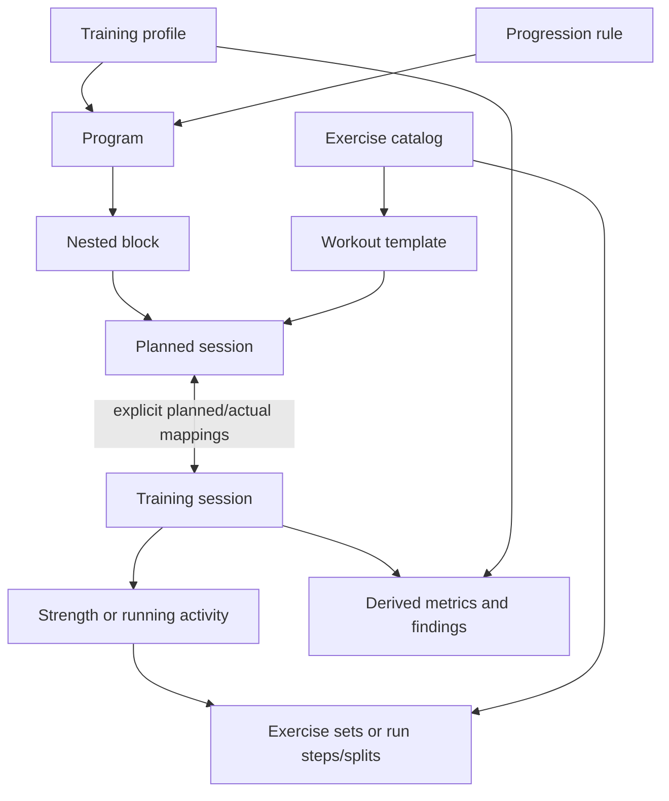

# Training Module Product Requirements

**Status:** Draft for engineering review · **Release:** Training MVP ·
**Audience:** Product and engineering · **Last updated:** 2026-07-12

## 1. Summary

The Kinetix Training module lets a single user define exercises, create structured
strength and running programs, generate planned sessions, record actual
performance, execute progression rules, and analyze the resulting history.

Training data must remain structured enough to support deterministic analytics
and future LLM interpretation. A completed set cannot be stored only as text such
as `3 × 9 × 50 kg`; its repetitions, load, measurement type, effort, exercise,
muscle involvement, prescription, and relationship to actual performance must be
queryable.

The first successful end-to-end journey is:

1. Create a complete training program.
2. Generate its planned workouts.
3. Track strength workouts and manual runs.
4. Compare planned and actual performance.
5. Calculate explainable analytics from the recorded facts.
6. Retrieve the same data and perform the same operations through the web app,
   REST API, and `kin` CLI.

The MVP requires only the Kinetix API and PostgreSQL at runtime. It does not
depend on Google Health, an LLM, blob storage, or a separate queue service.

## 2. Problem

Typical workout logs are optimized for human display and often collapse the
workout into free text. That makes it difficult to answer questions such as:

- Is the user progressively overloading an exercise?
- How closely did actual training match the program?
- Which muscle groups are receiving too much or too little work?
- How do exercise volume, intensity, pain, readiness, and performance relate?
- Which personal records were achieved?
- Is running pace or heart-rate efficiency improving?
- What progression should be applied to the next workout?

Kinetix needs a unified model for prescribed and completed strength/running
training that preserves raw facts, provenance, history, and derived analytics.
The model must support mixed sessions such as a run followed by core work without
flattening activity-specific data.

## 3. Goals

- Model strength and running as typed activities within one Training module.
- Store planned and actual sessions at session, activity, exercise, and set/step
  granularity.
- Support unplanned training as well as program-driven training.
- Provide an editable, seeded exercise catalog with analytically useful metadata.
- Support programs, templates, nested blocks, relative schedules, calendar
  schedules, and generated sessions.
- Capture objective measurements and structured subjective context.
- Execute bounded, versioned progression rules with explainable outcomes.
- Calculate versioned deterministic metrics and adherence scores.
- Accept full program/session trees through a dry-run, transactional JSON API.
- Provide functional parity between the public API and CLI.
- Retain user-visible history, source attribution, and restoration capability.
- Keep the model extensible to activity types beyond strength and running.

## 4. Non-goals for this release

- Google Health/Fitbit synchronization.
- Automatic ingestion of spreadsheets or unstructured text.
- Raw/high-frequency GPS, heart-rate, cadence, pace, or power samples.
- LLM-generated interpretations or program modifications.
- Improvement forecasts or medical/injury probability predictions.
- Advanced training-load/recovery warnings combining sleep and training volume.
- Cycling, swimming, walking, mobility, or other executable activity types.
- Offline workout tracking.
- Media attachments or technique-video analysis.
- Multi-user accounts, sharing, roles, or authentication.

The data model and API contracts should leave clean extension points for these
features, but they are not part of MVP acceptance.

## 5. Product principles

1. **Raw performance is authoritative.** Analytics, adherence, records, and
   findings are derived and reproducible.
2. **Missing is not zero.** An absent value means unknown or not applicable; zero
   is a known measurement.
3. **Prescription and performance are separate.** Editing a plan must not rewrite
   what was performed or what was originally prescribed.
4. **History remains explainable.** Catalog changes, corrections, progression,
   imports, and agent/API updates preserve their source and revision.
5. **Calculations are versioned.** Every derived metric identifies its formula
   and version.
6. **Rules are data, not arbitrary code.** Progression uses a bounded condition
   and action language that can be validated, audited, and safely executed.
7. **Provider detail can arrive later.** Manual running uses the same canonical
   summaries and splits that future provider adapters will populate.
8. **Web, CLI, and agents share one API.** No client receives privileged database
   access or unique business behavior.

## 6. User and operating assumptions

- There is one local/trusted user and no authentication in the MVP.
- The application requires API connectivity; offline entry and conflict merging
  are not required.
- The user may operate through the web app, CLI, or an agent calling the API/CLI.
- Multiple clients may still edit concurrently, so version-based optimistic
  concurrency is required.
- Training volumes are small enough for PostgreSQL without partitioning or a
  dedicated analytics system.

## 7. Domain terminology

| Term                  | Meaning                                                                                           |
| --------------------- | ------------------------------------------------------------------------------------------------- |
| Training profile      | Training-specific settings, experience, goals, limitations, zones, and training maxima.           |
| Exercise              | Canonical movement definition used by strength prescriptions and performances.                    |
| Workout template      | Reusable prescription that can be placed into programs or used directly.                          |
| Program               | A versioned training plan containing nested blocks and planned sessions.                          |
| Block                 | A nestable program phase; defaults include macrocycle, mesocycle, and microcycle/week.            |
| Planned session       | A prescribed session positioned by date, relative order, or both.                                 |
| Training session      | The actual or in-progress workout container on a local training date.                             |
| Activity              | An ordered typed section of a session, initially strength or running.                             |
| Exercise occurrence   | One ordered appearance of an exercise within a strength activity.                                 |
| Set group             | A structure representing straight sets, supersets, circuits, drops, clusters, or rest-pause work. |
| Planned/performed set | A single prescribed/performed unit with structured measurements.                                  |
| Run step              | A planned or performed warm-up, work, recovery, repeat, or cool-down segment.                     |
| Split/lap             | An arbitrary performed subdivision of a run.                                                      |
| Progression rule      | A versioned condition/action definition that proposes or safely applies plan changes.             |
| Derived metric        | A reproducible calculation from authoritative training or contextual facts.                       |
| Finding               | A persisted, explainable analytic observation such as a personal record.                          |

## 8. Conceptual model



A Training session is a container so one workout can contain multiple ordered
activities. A run followed by core strength work is one session containing a
running activity and a strength activity. Each activity has its own duration and
subjective effort; session duration is independent because it may also include
transitions and untracked rest.

Planned and performed records are mapped explicitly at session, activity,
exercise, set, and run-step levels. The mapping is not limited to one-to-one: a
planned set may result in several performed sets, performed work may combine
prescriptions, and an actual session may satisfy sessions from multiple programs.

## 9. Supporting profile and contextual data

The MVP includes the contextual records needed by Training even though ownership
crosses module boundaries.

### 9.1 Core profile

The single-user core profile contains:

- optional birth date, from which current age is derived;
- sex;
- editable current height;
- default time zone;
- default unit preferences.

Height is editable but does not require history. Contextual profile fields are
optional except the time-zone and unit defaults needed to interpret entries.

### 9.2 Training-owned profile data

Training owns:

- training experience;
- one or more simultaneous goals;
- injuries and limitations;
- training maxima;
- heart-rate, pace, and power zone definitions used by prescriptions;
- equipment/load increments and available equipment where configured.

A goal may contain type, target, unit, start date, optional target date, priority,
status, notes, and an optional program relationship.

Injuries and limitations may include body area, left/right/bilateral side,
severity, status, name/diagnosis, start/end date, notes, affected muscles, and
affected exercises.

### 9.3 Health Data-owned manual context

Health Data owns time-series records for:

- bodyweight;
- sleep;
- resting heart rate;
- readiness and other health observations.

Manual entry must be available before provider synchronization exists. Training
analytics consume these records through a public query interface and must still
run when context is missing, identifying unavailable factors explicitly.
General daily readiness is a Health Data record; readiness captured immediately
before a workout is part of that Training session.

## 10. Exercise catalog requirements

### EX-1: Seeded and custom exercises

The system shall seed a useful catalog of common strength exercises. The user may
create custom exercises and create user-owned versions of seeded exercises.
Editing a seeded definition must not mutate the original seed globally.

### EX-2: Exercise metadata

Each exercise shall support:

- name and case-insensitive aliases;
- status (`active` or `archived`);
- equipment;
- movement pattern;
- compound or isolation classification;
- unilateral or bilateral classification;
- body position;
- repetition semantics (`total`, `per_side`, or `alternating`);
- supported measurement combinations;
- primary and secondary muscle groups;
- optional notes and tags.

Difficulty, instructions, and recommended alternatives are not required.

### EX-3: Controlled and extensible taxonomies

Muscle groups are system-controlled to protect analytics consistency. The seeded
high-level catalog shall cover at least:

- chest;
- back;
- shoulders;
- biceps;
- triceps;
- forearms/grip;
- core;
- glutes;
- quadriceps;
- hamstrings;
- calves;
- hip flexors;
- adductors/abductors;
- full body.

Muscle involvement is primary or secondary. The MVP shall not assign invented
fractional contribution weights.

Equipment and movement patterns use controlled catalogs but permit custom values.
The product shall warn that custom categories may not participate in standard
aggregations until mapped.

### EX-4: Exercise relationships

Exercises may have optional `variation_of`, `progression_of`, and `regression_of`
relationships. A separate explicit relationship indicates that exercises belong
to the same analytics family; a variation relationship alone does not imply
direct performance comparability.

### EX-5: Historical snapshots

Each planned or performed exercise occurrence shall retain the analytically
relevant exercise snapshot used at that time: name, muscles, equipment, movement
pattern, classification, and repetition semantics.

Analytics may operate against the historical snapshot or the latest corrected
catalog version. Results must identify which basis was used.

### EX-6: Merge and archive

The user may merge duplicate exercises. Merging shall:

- retain aliases and source IDs;
- safely redirect current references;
- remain reversible through history;
- trigger invalidation of affected analytics.

An exercise with historical references is archived rather than physically
deleted and cannot be selected for new work unless restored.

## 11. Program, block, and template requirements

### PR-1: Program lifecycle

Programs support `draft`, `active`, `paused`, `completed`, and `archived` states.
A program may be restored by creating a new current revision. Deletion archives
the program and preserves planned/actual relationships.

Multiple programs may be active. A planned or actual session may relate to more
than one program, and adherence is calculated independently against each
prescription.

### PR-2: Scheduling modes

A program may be:

- calendar-based with exact dates;
- relative, such as week/day positions;
- ordered without dates;
- or a combination.

Start/end dates and goals are optional. A relative program can remain active and
ordered without a start date. Assigning a start date calculates calendar dates
while retaining relative positions.

Changing a program start date moves only incomplete future sessions. Missed
sessions remain overdue until explicitly completed, skipped, cancelled, or
rescheduled; Kinetix does not automatically shift the remainder of the program.

Planned sessions may have an optional preferred time of day. Schedule collisions
and overlapping blocks are allowed but surfaced as warnings.

### PR-3: Nested blocks

Programs support nestable blocks with the default types:

- macrocycle;
- mesocycle;
- microcycle/week.

The user may override the label/type or use a generic custom block. Blocks may
overlap, though the UI and API dry-run shall warn when they do.

Blocks support:

- sequence and optional date range;
- goal/focus;
- target muscles;
- target volume and intensity;
- deload flag;
- expected adaptations;
- notes and tags.

### PR-4: Workout templates

Reusable workout templates exist independently of programs and may contain mixed
strength/running activities. Placing a template into a program creates a planned
snapshot. Later template changes do not silently rewrite existing planned
sessions.

The product may offer an explicit “update future sessions” operation, which
creates new revisions and leaves completed/history snapshots intact.

### PR-5: Planned session generation

Activating a dated program generates every planned session for the program at the
expected MVP scale. An undated relative program generates ordered, unscheduled
sessions.

Each planned session supports:

- date or relative position;
- preferred time;
- sequence;
- expected duration;
- goals and notes;
- tags;
- ordered planned activities;
- state (`planned`, `completed`, `partially_completed`, `skipped`, or
  `cancelled`);
- optional structured skip/cancel reason and notes.

Supported reasons include illness, fatigue, pain, schedule, recovery, and
equipment unavailable, with an extensible fallback.

### PR-6: Program versioning

Programs, blocks, templates, and planned sessions are editable after activation.
Edits create revisions and a human-readable change summary. Historical
prescriptions and completed-session mappings remain unchanged.

## 12. Training session requirements

### TS-1: Session lifecycle

An actual Training session may be `draft`, `in_progress`, `completed`, or
`archived`. A session can be created without a planned session.

An in-progress session supports multiple saves. A completed session may be
reopened and corrected through a new revision. Deletion is soft deletion/archive
so analytics can exclude it while restoration remains possible.

### TS-2: Time representation

A session stores:

- local training date;
- optional start timestamp;
- time-zone identifier;
- optional completed/end timestamp;
- optional actual duration;
- optional preferred/planned time through its prescription.

A session crossing midnight remains associated with the local date on which it
started. Session duration is independent of the sum of activity durations.

### TS-3: Mixed and ordered activities

A session contains one or more ordered activities. MVP activity types are
`strength` and `running`; the discriminator and contracts must support future
types without using a generic text blob.

Every activity supports:

- order;
- optional start/end/duration;
- planned/actual mappings;
- notes and tags;
- subjective effort and feeling fields applicable to that activity.

### TS-4: Planned versus actual mappings

The system shall map planned and actual records at:

- session;
- activity;
- exercise occurrence;
- set;
- run step.

Mappings support one-to-one, one-to-many, and many-to-one relationships.
Performed additions, omissions, substitutions, and partial work remain explicit.

A substitution records the prescribed exercise, performed exercise, reason, and
notes.

### TS-5: Readiness and subjective experience

The session supports structured pre-workout readiness:

- energy;
- motivation;
- fatigue;
- soreness;
- stress;
- perceived recovery.

These use a 1–5 scale. Post-workout/session ratings support energy, motivation,
enjoyment, difficulty, fatigue, and notes. Activities and exercises may record
relevant effort/feeling details.

### TS-6: Pain and discomfort

Pain/discomfort records support:

- body area;
- left/right/bilateral side;
- severity from 0–10;
- type;
- whether it began during the session;
- whether it caused a set/exercise to stop;
- optional exercise/set relationship;
- notes.

### TS-7: Notes and tags

Programs, blocks, templates, sessions, activities, and exercises support notes
where applicable. Media is not required.

Tags are freely user-created and normalized case-insensitively so `Long Run` and
`long run` identify the same tag.

## 13. Strength activity requirements

### ST-1: Exercise occurrences

A strength activity contains ordered exercise occurrences. The same exercise may
appear more than once with different purposes, groups, prescriptions, or notes.
Order is always persisted for future density and fatigue analysis.

An occurrence supports:

- exercise and historical metadata snapshot;
- order;
- purpose/notes;
- planned/actual relationship;
- perceived technique quality, discomfort, and pump;
- set groups and sets.

Technique and pump use a 1–5 scale when supplied.

### ST-2: Set groups

Set groups preserve structure and execution order for:

- straight sets;
- supersets;
- circuits;
- drop sets;
- cluster sets;
- rest-pause work.

The group represents relationships among sets/exercises; individual performed
sets still retain their own facts. Grouping must be available to analytics so
density, fatigue, and rest can be interpreted correctly.

### ST-3: Set types and state

Set types include:

- warm-up;
- working;
- back-off;
- drop;
- failure/AMRAP;
- superset/circuit member;
- rest-pause;
- technique;
- cluster;
- custom/other.

Relative to a prescription, a performed set records `completed`, `partial`,
`skipped`, or `added` state. It may also record a structured failure/stop reason
and notes.

### ST-4: Structured set measurements

Each planned/performed set supports applicable combinations of:

- whole-number repetitions;
- external load;
- bodyweight at the session;
- added bodyweight load;
- assistance load;
- duration;
- distance;
- power in watts;
- RPE;
- RIR;
- tempo;
- rest before and/or after;
- completion state and notes.

Measurement combinations are validated but not mutually exclusive. A weighted
carry may contain load, distance, and duration. Bodyweight, added load, assistance
load, and derived effective load remain separate.

If bodyweight is missing, effective-load volume is omitted while sets and
repetitions remain valid. A zero load is different from an unknown/absent load.

### ST-5: Planned targets

Planned values may be exact or ranges. A prescription supports:

- number/range of sets;
- repetitions/range;
- exact/range load;
- duration, distance, power, or pace targets where applicable;
- RPE/RIR target;
- percentage of estimated 1RM;
- percentage of training max;
- bodyweight plus/minus load;
- tempo and rest;
- structured progression-rule references.

Percentage-based loads are resolved immediately before performance using the
latest applicable training maximum and configured equipment increments.

### ST-6: Effort scales

- RPE uses 1–10 and permits 0.5 increments.
- RIR uses whole numbers from 0–10.
- Pain uses 0–10.
- Energy, motivation, enjoyment, technique, pump, fatigue, soreness, stress, and
  recovery use 1–5.

Actual tempo and rest are optional and may be marked or interpreted as manually
entered/low-confidence measurements.

### ST-7: Unilateral semantics

The exercise snapshot determines whether repetitions are total, per side, or
alternating. For `per_side`, `10` means ten repetitions on each side unless the
exercise is explicitly logged as separate left/right sets.

## 14. Running activity requirements

### RN-1: Run classification

A run supports multiple case-insensitive tags, including seeded tags for:

- easy;
- recovery;
- long;
- tempo/threshold;
- intervals;
- progression;
- race;
- time trial;
- hill repeats;
- treadmill;
- trail.

Custom tags are allowed.

### RN-2: Optional run summary

A manual run may contain any available subset of:

- distance;
- moving time;
- elapsed time;
- derived average pace;
- optional recorded best pace;
- average and maximum heart rate;
- time in heart-rate zones;
- cadence;
- running power;
- elevation gain/loss;
- calories;
- stride length;
- ground-contact time;
- vertical oscillation;
- VO₂ max estimate;
- indoor/outdoor and treadmill status;
- surface and terrain;
- temperature, humidity, and wind;
- route reference or optional geometry when readily available;
- shoes/equipment;
- subjective RPE and notes.

Moving and elapsed time are independent and optional. Average pace is derived
from distance and moving time rather than treated as an independent fact.

### RN-3: Planned run structure

Planned runs support structured nested steps, including warm-up, work, recovery,
repeat, and cool-down. Each step may target:

- distance;
- duration;
- pace or speed range;
- heart-rate value/range/zone;
- power value/range/zone;
- cadence;
- RPE;
- open-ended completion.

Performed steps map individually to planned steps.

### RN-4: Splits and laps

Manual entry supports arbitrary splits/laps with distance, moving/elapsed time,
pace, heart rate, cadence, power, elevation, and notes where known.

High-frequency sensor/GPS samples are deferred to provider integration. The
canonical run model must permit future association with those samples without
changing manual summary semantics.

### RN-5: Zones

Heart-rate, pace, and power zone definitions are configurable and versioned.
Historical runs use the zone version valid at performance time.

Supported heart-rate calculation methods include:

- percentage of maximum heart rate;
- percentage of heart-rate reserve;
- lactate-threshold heart rate;
- manually configured boundaries.

### RN-6: Shoes and equipment

Runs may reference shoes/equipment. The product may calculate accumulated
distance and surface retirement warnings. All equipment data is optional.

## 15. Adherence requirements

### AD-1: Component metrics

Adherence shall be independently calculated for:

- session completion;
- activity completion;
- exercise completion;
- set completion;
- repetitions;
- load;
- external-load volume;
- duration;
- distance;
- pace/intensity;
- RPE/RIR target.

Metrics must account for partial, skipped, added, substituted, one-to-many, and
many-to-one actual work.

### AD-2: Overall adherence

Kinetix shall provide both component metrics and an overall percentage. The
overall score uses a system-defined, versioned formula with visible components.
User-defined weights are not required in MVP.

An actual session linked to several planned sessions receives an independent
adherence result for each prescription.

### AD-3: Explainability

Every adherence result identifies:

- planned and actual record IDs/revisions;
- formula name/version;
- component inputs;
- exclusions caused by missing or non-comparable data;
- calculation time.

## 16. Progression-rule requirements

### PG-1: Rule format

Rules use a versioned JSON expression tree with nested `all`, `any`, and `not`
conditions. Comparisons and actions come from fixed, schema-validated allowlists.
Arbitrary code or free-form expressions are forbidden.

Rules may be attached to:

- program;
- block;
- workout template;
- planned exercise;
- individual planned set.

### PG-2: Supported conditions

The initial rule language shall support conditions based on:

- completion of prescribed sets;
- top/bottom of a repetition range;
- RPE/RIR target;
- estimated 1RM change;
- consecutive successful or failed sessions;
- skipped sessions;
- reported pain;
- readiness or sleep threshold;
- weekly volume/load threshold;
- date, week, or block boundary.

### PG-3: Supported actions

The initial action allowlist shall support:

- increase/decrease load by absolute value or percentage;
- increase/decrease repetitions;
- increase/decrease sets;
- change RPE/RIR target;
- change duration, distance, pace, or power target;
- substitute an exercise;
- repeat a week/block;
- insert or mark a deload;
- reschedule or skip a session;
- emit a recommendation without changing the plan.

An action may target the next occurrence, all future occurrences in the current
block, or the underlying template.

### PG-4: Evaluation triggers

Rules may evaluate:

- after session completion;
- on a schedule;
- manually on demand.

### PG-5: Approval and automatic execution

The default outcome is a proposed change requiring approval. A rule may opt into
automatic application only when:

- the resulting actions do not conflict;
- every action is within configured safety limits;
- no action changes the underlying template;
- the rule is explicitly enabled for automatic application.

Template-level changes always require approval. Conflicting rules stop and enter
the central approval queue rather than resolving by hidden priority.

Safety limits include configurable maximum load increase, weekly volume increase,
minimum recovery interval, active pain, and poor-readiness thresholds.

### PG-6: Equipment-aware load resolution

Load changes respect configured equipment increments and available weights. For
example, barbell prescriptions may round to 2.5 kg while a machine uses its stack
increments.

### PG-7: Evaluation history

Every evaluation persists:

- trigger and time;
- rule and version;
- input metric IDs/values;
- matched and unmatched conditions;
- proposed actions;
- safety/conflict checks;
- human-readable explanation;
- approval/application status and actor;
- resulting entity revisions.

Applying a progression creates new future prescription revisions; it never
rewrites historical prescriptions.

### PG-8: Approval experience

Pending recommendations and conflicts appear:

- in a central approval queue;
- on the affected program/block/session;
- through equivalent API and CLI queries/actions.

## 17. Deterministic analytics requirements

### AN-1: Authoritative inputs and derived outputs

Raw profile, health context, prescriptions, and performance facts are
authoritative. Metrics and findings are versioned derived artifacts that can be
invalidated and regenerated.

Changing a session, exercise definition, mapping, bodyweight entry, zone, or
formula-invalidating input automatically marks affected results stale and queues
recalculation.

### AN-2: Strength analytics

The MVP shall calculate, where inputs permit:

- sets and repetitions;
- external-load volume;
- bodyweight/assisted effective-load volume when bodyweight is known;
- direct and indirect muscle-set counts, kept separate;
- weekly muscle frequency and volume;
- hard-set counts using configurable RPE/RIR criteria;
- time under tension when tempo/duration is available;
- exercise-specific volume and trends;
- personal records;
- estimated 1RM.

Volume across unrelated exercises must not be presented as directly comparable
performance. Related-exercise aggregation uses explicit analytics-family
relationships.

### AN-3: Estimated 1RM

The system retains results from at least:

- Epley;
- Brzycki;
- Lombardi;
- Mayhew;
- O'Conner;
- Wathan.

The user sees one selected primary estimate with formula details available. The
calculation excludes warm-up sets and sets over a configurable repetition
threshold. Algorithm, configuration, inputs, and version are persisted.

### AN-4: Personal records

The MVP detects applicable records for:

- maximum load;
- estimated 1RM;
- repetition maximum at a given load;
- total exercise volume;
- longest duration/distance;
- fastest standard running distance;
- best pace;
- highest power.

### AN-5: Running analytics

The MVP shall calculate, where inputs permit:

- distance, duration, pace, and frequency trends;
- heart-rate summaries and zone time;
- pace/heart-rate and power trends;
- cadence/elevation summaries;
- running personal records;
- session RPE load;
- rolling 7-day and 28-day activity load.

Several load models may coexist, including session-RPE load and heart-rate-based
models when sufficient input exists. MVP does not choose one universal load score.

### AN-6: Summary windows

Analytics are available for sensible defaults and configurable ranges, including:

- session;
- day;
- calendar week;
- rolling 7 and 28 days;
- program block;
- complete program;
- custom date range;
- current-versus-previous block comparison.

### AN-7: Minimum history

Trends require at least three comparable sessions from the exact activity/exercise
or an explicitly related analytics family. Results must label which basis was
used. The UI must not imply a reliable trend when the minimum is not met.

### AN-8: Recalculation behavior

Completion/correction of a session queues targeted recalculation immediately.
The system also supports scheduled and manual full recalculation.

While recalculation is in progress, the API may return the previous result marked
`stale` together with job/status information.

### AN-9: Findings

Persisted findings include algorithm/version, evidence, generated time, optional
review/expiration date, status, and affected scope. The user may acknowledge,
dismiss, or mark a finding useful/incorrect.

MVP findings include deterministic events such as records and adherence changes.
Advanced improvement projections and recovery/injury-risk warnings are deferred.

### AN-10: Deterministic versus interpretive output

The API and UI distinguish a calculated fact from an interpretation. For example:

- Metric: “Direct chest sets increased from 12 to 18.”
- Interpretation: “This increase may impair recovery.”

Only deterministic metrics/findings are generated in MVP. Future LLM or warning
services must reference their contributing metrics and missing context.

## 18. Units and precision

### UN-1: Supported units

Input/display support includes:

- kilograms and pounds;
- metres, centimetres, kilometres, and miles;
- seconds, minutes, and hours;
- watts;
- pace and speed representations derived from canonical facts.

### UN-2: Canonical storage

Measurements use consistent canonical units internally while preserving the unit
entered by the caller for faithful display and audit. Conversion must not mutate
the authoritative entered value.

Durations, distances, and loads require sufficient precision for calculation;
rounding for display or equipment happens explicitly at the boundary/rule action.

### UN-3: Null and zero

Validation and API contracts distinguish:

- omitted: no update in patch/upsert operations;
- explicit `null`: clear an optional value;
- zero: known zero measurement.

Analytics must never coerce missing values to zero.

## 19. Bulk JSON API requirements

### BI-1: Scope

The API accepts structured JSON for complete programs and sessions. Spreadsheet
parsing is outside Kinetix; an LLM/agent may transform source data into the
published JSON contract before calling the API or CLI.

### BI-2: Versioned contracts

Every bulk payload includes a required schema version. Contracts support agent
adaptation and clear validation errors when versions are unsupported.

### BI-3: Stable external IDs

Callers may provide stable external IDs for programs, blocks, sessions,
activities, exercise occurrences, sets, and run steps. These IDs support safe
retries and later idempotent updates/upserts.

External IDs are namespaced by source/caller to prevent collisions.

### BI-4: Dry-run

Every bulk creation/update supports dry-run. The result includes:

- normalized units;
- resolved catalog IDs and snapshots;
- missing/ambiguous exercise mappings;
- warnings, including overlaps and schedule collisions;
- generated dates and session counts;
- validation errors with paths;
- complete normalized proposed object tree;
- a short-lived approval token or revision hash.

Commit must verify that the approved payload and relevant referenced revisions
match the dry-run. If they changed, the caller must run preview again.

### BI-5: Unknown exercises

Unknown exercises appear in preview and require mapping/approval. Trusted callers
may explicitly request creation of missing custom exercises, but the proposed
definitions and metadata remain visible in dry-run.

### BI-6: Atomicity and idempotency

Bulk program creation/update is transactional and all-or-nothing. No partial
program is committed when any item fails. The endpoint accepts an idempotency key
and safe retry semantics.

### BI-7: Patch behavior

For upserts/updates:

- omitted fields remain unchanged;
- explicit `null` clears an optional field;
- version mismatches reject the operation;
- all resulting changes enter user-visible history.

## 20. API requirements

The REST API is versioned under `/api/v1`. Exact endpoint design belongs to the
technical design, but the public surface must cover:

- profile and manual contextual measurements;
- muscle, equipment, movement-pattern, and exercise catalogs;
- exercise aliases, versions, relationships, merge, archive, and restore;
- templates;
- programs, nested blocks, scheduling, revisions, activation, archive, restore;
- planned sessions and generation;
- in-progress and completed Training sessions;
- strength activities, groups, exercises, and sets;
- running summaries, planned steps, performed steps, and splits;
- adherence results;
- progression rules, evaluations, approval queue, application/rejection;
- analytics, findings, recalculation, and status;
- bulk dry-run and commit;
- history and revision restoration.

### API-1: Validation

Public request/response contracts use Zod as their validation source of truth and
are represented in OpenAPI. Errors are machine-readable and include a stable
code, message, field/path errors where applicable, and correlation ID.

### API-2: Concurrency

Editable resources expose a version. A stale write is rejected with a conflict
response containing the current version; the caller must reload/reconcile.

### API-3: Idempotency

Creation, bulk, progression application, restore, and other retry-prone commands
support idempotency keys.

### API-4: Async calculations

Analytics recalculation and other durable work may return `202 Accepted` and a
job resource. Jobs run through PostgreSQL-backed workers in the API deployment.

## 21. CLI requirements

Everything possible through the public API must be accessible through `kin`,
including bulk operations, dry-runs, versioned updates, active workout tracking,
progression approval, analytics, and history.

Illustrative commands:

```text
kin training exercises list --json
kin training exercises create --file exercise.json
kin training programs dry-run --file program.json
kin training programs apply --file program.json --approval-token ...
kin training programs activate <program-id>
kin training sessions start <planned-session-id>
kin training sets complete <set-id> --reps 8 --weight 80kg --rpe 8
kin run add --distance 10km --moving-time 52m --avg-heart-rate 151
kin training progression pending --json
kin training progression approve <evaluation-id>
kin training analytics show --range 28d --json
kin training history show <resource-id>
```

Requirements:

- `--json` input/output for agents;
- non-interactive operation for every command;
- stdin/file input for large payloads;
- deterministic exit codes;
- support for expected resource version and idempotency key;
- long-running job IDs and optional `--wait` with timeout;
- server timestamps for active/rest timing, with terminal presentation handled by
  the CLI.

The CLI may present highly interactive features more simply than the web app, but
it may not omit the underlying operation.

## 22. Web experience requirements

### UX-1: Catalog

The user can browse, search, create, version, archive, merge, and restore
exercises and see their muscles, equipment, movement pattern, measurement types,
and relationships.

### UX-2: Program builder

The user can create a program, nest blocks, place templates/sessions, configure
relative or dated schedules, define prescriptions/rules, preview generated
sessions, resolve warnings, and activate the program.

### UX-3: Workout tracking

The active workout experience supports:

- starting from a planned session, template, previous workout, or empty session;
- active session and rest timers;
- adding/reordering activities, exercises, groups, and sets during the workout;
- recording planned versus actual values set by set;
- substitutions, added/partial/skipped work;
- readiness, effort, pain, notes, and tags;
- saving and resuming an in-progress session;
- completing and later correcting a session.

The client requires API connectivity. The server stores timestamps; countdown and
rest-timer display is a client responsibility.

### UX-4: Running entry

The user can create a manual run, add summary measurements, arbitrary splits,
structured performed intervals, environment/equipment, effort, pain, notes, and
planned mappings.

### UX-5: Analytics

The user can view:

- session/program adherence and components;
- strength, muscle, 1RM, personal-record, running, and load metrics;
- default/configurable ranges and block comparisons;
- stale/recalculation state;
- algorithm/formula details and source evidence;
- persisted findings and feedback controls.

### UX-6: Approval queue and history

The user can review progression proposals/conflicts, see the exact before/after
change, approve/reject it, and inspect the resulting revision.

User-visible history records the change source: web, CLI, agent, import, rule, or
future provider sync. History presents version snapshots and a human-readable
summary rather than requiring a full field-level diff. Restoring a version creates
a new current revision.

## 23. History and provenance

Important mutations include:

- actor/source;
- time and correlation ID;
- entity and previous/new revision;
- human-readable summary;
- reason or linked progression/import/API operation;
- external source IDs where applicable.

Sources include `web`, `cli`, `agent`, `bulk_import`, `progression_rule`,
`manual_correction`, and future `provider_sync`.

Historical exercise snapshots and planned prescriptions are retained even when
their source catalog/template is archived or changed.

## 24. Functional acceptance scenarios

### AC-1: Complete strength program journey

Given a user with a Training profile and exercise catalog, when they create a
relative program with nested blocks, strength templates, set prescriptions, and
progression rules, then they can activate it and Kinetix generates all ordered
planned sessions without losing relative positions.

### AC-2: Structured bulk program creation

Given a versioned JSON program payload with caller external IDs, when an agent
runs dry-run, resolves exercise mappings, and commits using the approval token,
then the entire normalized program is created transactionally. Repeating the
same request does not duplicate it.

### AC-3: Mixed workout tracking

Given a planned session containing a run and strength/core work, when the user
starts and completes it, then both activities remain ordered under one session,
retain separate duration/effort data, and map to their planned records.

### AC-4: Planned versus actual strength

Given a prescription for three sets, when the user performs different repetitions
or load, adds a set, skips a set, or substitutes an exercise, then every difference
is structured and the adherence result explains its component percentages.

### AC-5: Bodyweight and compound measurements

Given bodyweight work, assisted work, or a weighted carry, when the user records
bodyweight/additional/assistance load or load/distance/duration, then the facts
remain separate and compatible analytics are calculated without coercing missing
measurements to zero.

### AC-6: Manual run

Given no provider connection, when the user records a manual run with distance,
moving time, average/max heart rate, structured intervals, and arbitrary splits,
then pace and available summaries are calculated and the run participates in
program adherence and running trends.

### AC-7: Progression proposal

Given a completed session matching a progression rule, when evaluation runs, then
the user sees the matched inputs, proposed future changes, safety checks, and
explanation in the approval queue. Approval creates new future revisions without
altering history.

### AC-8: Progression conflict

Given two rules proposing conflicting changes, when they evaluate, then no hidden
priority applies either change and the conflict requires user approval.

### AC-9: Analytics and invalidation

Given at least three comparable sessions, when analytics run, then applicable
strength/running trends, adherence, 1RM results, and records identify their inputs
and algorithm versions. Correcting a source session marks affected results stale
and queues recalculation.

### AC-10: Catalog correction

Given a performed exercise whose catalog metadata is later changed or merged,
when history and analytics are viewed, then the historical snapshot is available,
latest-definition re-analysis is possible, and the basis is labeled.

### AC-11: Schedule behavior

Given a dated active program, when a session is missed or another program places
a session on the same date, then Kinetix warns but does not silently reschedule
or discard work.

### AC-12: Concurrency and history

Given the web app and an agent editing the same version, when the second stale
write arrives, then it is rejected. After a successful edit, the user can see its
source, version snapshot, summary, and restore it by creating a new revision.

### AC-13: API/CLI parity

Given any public Training operation used by the web app, an agent can perform the
same operation non-interactively through the API or CLI with structured JSON and
machine-readable results.

## 25. Non-functional requirements

### Correctness

- Analytics use explicit units, formulas, configurations, and source revisions.
- Transactions protect aggregate and bulk consistency.
- Idempotency and unique source IDs prevent duplicate writes.
- Generated schedules and progression outcomes are reproducible.

### Explainability

- Adherence, progression, analytics, and findings expose inputs and versions.
- Missing data and excluded comparisons are visible rather than silently guessed.
- Deterministic metrics are labeled separately from future interpretations.

### Extensibility

- Activity-specific detail is typed and separate from the common session
  envelope.
- New activity types can be added without changing existing strength/run facts.
- Calculators and progression conditions/actions use versioned registries.
- Provider ingestion can later map into the same canonical session/run model.

### Operability

- Recalculation jobs are retryable and idempotent.
- Failures identify the affected entity/range and do not corrupt authoritative
  facts.
- Normal CRUD and live tracking remain usable while historical analytics
  recompute.

### Security baseline

- The unauthenticated MVP is limited to a trusted/local deployment.
- Inputs are schema-validated and arbitrary rule code is forbidden.
- Logs avoid recording complete health payloads and notes by default.

## 26. Release slices

Implementation should proceed as vertical, testable slices:

1. **Foundations:** profile/context contracts, units, catalogs, revision/history,
   idempotency, optimistic concurrency.
2. **Exercise catalog:** seed data, custom versions, taxonomy, relationships,
   merge/archive/restore.
3. **Programs:** templates, nested blocks, scheduling, generation, snapshots, bulk
   dry-run/commit.
4. **Strength tracking:** mixed session container, active workout, activities,
   exercise occurrences, groups, sets, planned/actual mappings.
5. **Running:** manual summaries, structured planned/performed steps, splits,
   zones, shoes/equipment.
6. **Adherence:** component and overall versioned calculations.
7. **Progression:** rule schema/evaluator, safety/conflict handling, approval
   queue, revision application.
8. **Analytics:** strength/running metrics, 1RM, records, windows, invalidation,
   findings and recalculation jobs.
9. **CLI parity:** deliver CLI commands with each slice rather than postponing all
   CLI work to the end.

## 27. Dependencies and constraints

- NestJS API, React/Vite web app, `kin` CLI, PostgreSQL/Drizzle, Zod/OpenAPI.
- PostgreSQL-backed jobs may run inside the API process for MVP.
- No external provider, LLM, blob store, Redis, or message broker is required.
- The module follows the onion boundaries and communication rules in
  [the architecture document](../ARCHITECTURE.md).

## 28. Deferred follow-up products

The following should receive separate requirements/design work after Training
MVP:

1. Google Health synchronization, source reconciliation, and high-frequency
   running samples.
2. Advanced load/recovery warnings combining training, sleep, resting heart rate,
   readiness, and pain.
3. LLM coach access to Training read models and approval-gated mutation tools.
4. Improvement forecasting with confidence and minimum-history requirements.
5. Additional activity types.
6. Offline/mobile workout tracking and synchronization.

## 29. Product decisions complete

The requirements elicitation for Training MVP is complete. Remaining choices—SQL
tables, aggregate boundaries, endpoint paths, exact adherence weights, primary
1RM selection, rule JSON schema, job design, and component layout—belong to the
technical design. They must preserve the behavior and acceptance criteria in this
PRD.

The proposed implementation is documented in the
[Training technical design](../design/TRAINING.md).
